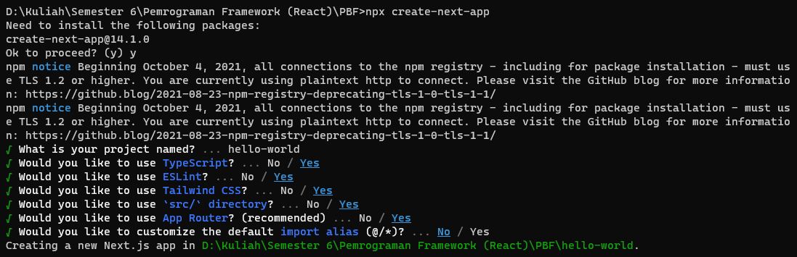
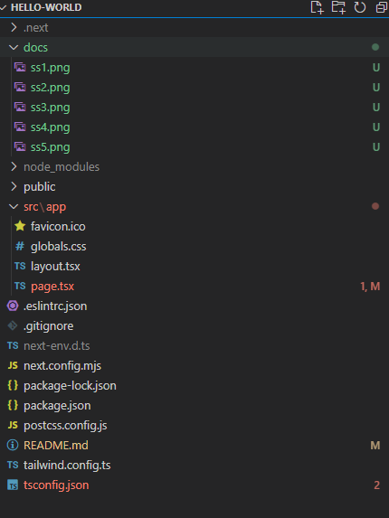
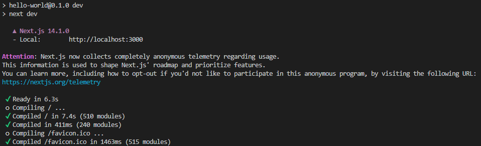
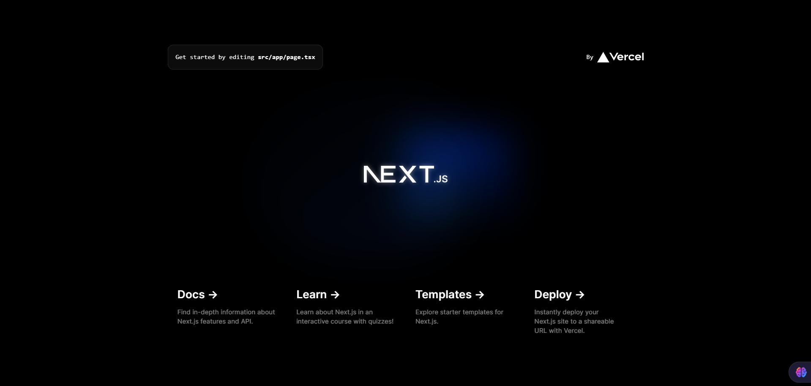
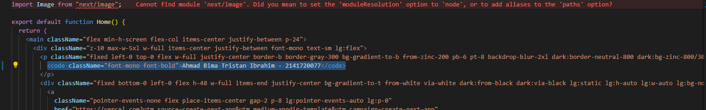
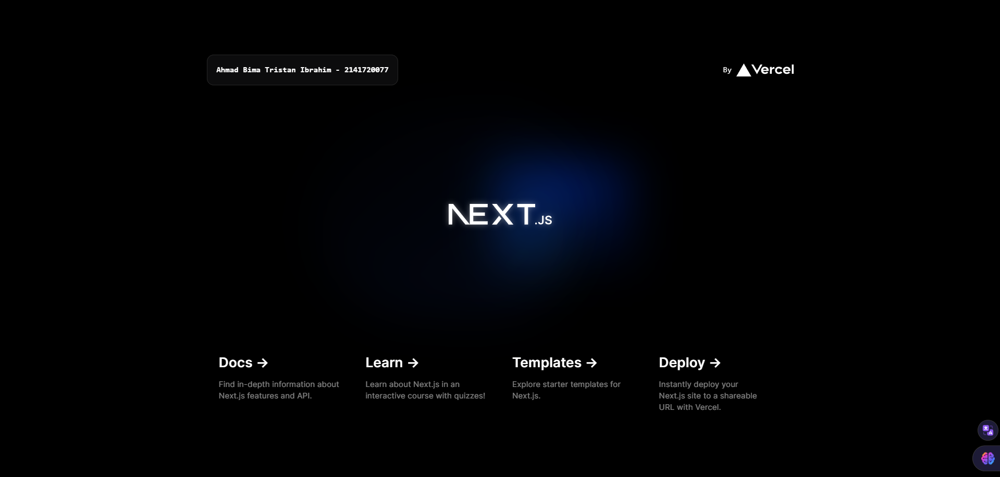
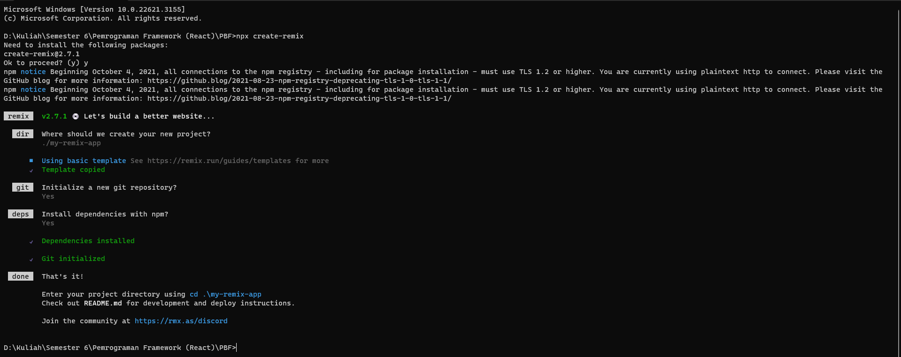
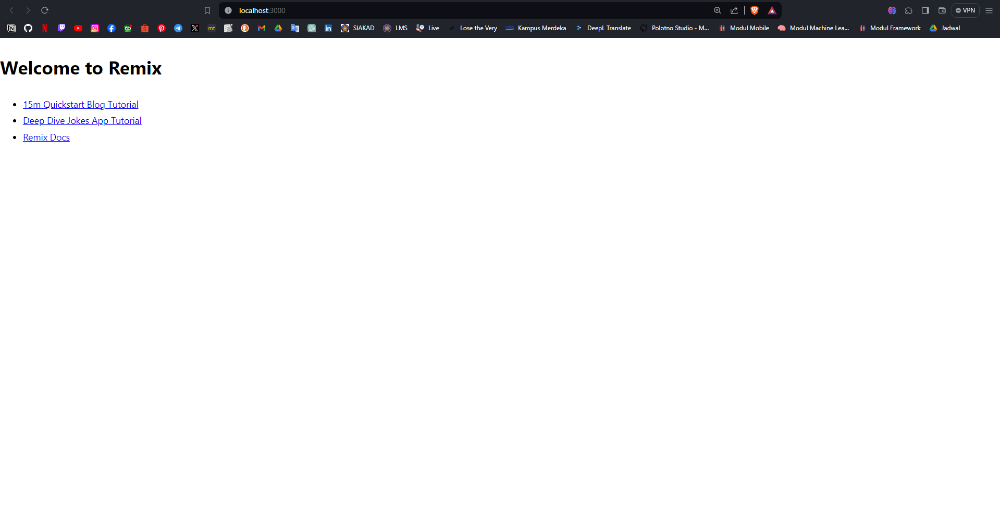
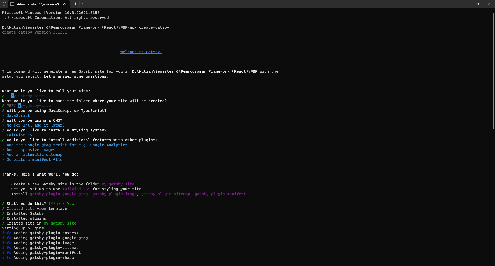
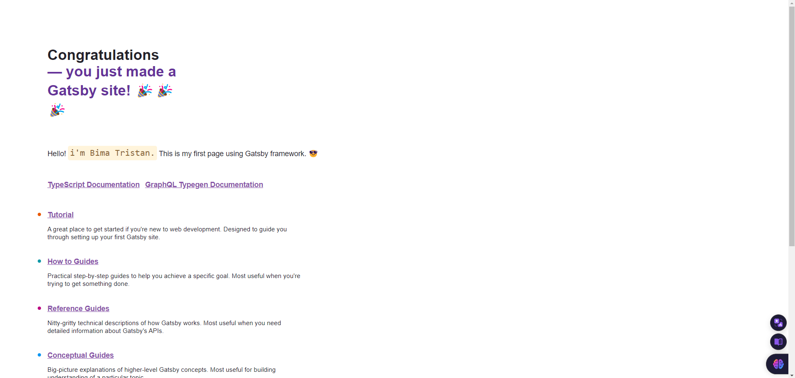

# Praktikum: Membuat Project Pertama ReactJS

### Langkah 1: Buat Folder Baru
```
npx create-next-app
```
### Langkah 2: Buat project baru
<br />

Output dari praktikum langkah 1 dan 2


<br />

>**Soal 1**
>Pada gambar tersebut, silakan Anda browsing apa yang dimaksud dengan:
>
>- TypeScript
>- ESLint
>- Tailwind CSS
>- App Router
>- Import alias

Jawab: 
- *Typescript*: TypeScript adalah superset dari JavaScript. Artinya, TypeScript yang dikembangkan oleh Microsoft ini memperluas JavaScript dengan menambahkan fitur-fitur baru. 
- *ESlint*: ESLint adalah alat analisis kode statis untuk mengidentifikasi pola bermasalah yang ditemukan dalam kode JavaScript. Aturan dalam ESLint dapat dikonfigurasi, dan aturan khusus dapat ditentukan dan dimuat. ESLint mencakup kualitas kode dan masalah gaya pengkodean.
- *Tailwind CSS*: Berdasarkan Hubspot, Tailwind CSS adalah utility-first framework CSS yang didesain untuk mempermudah dan mempercepat pembuatan aplikasi menggunakan desain custom.
- *App Router*: Pada dasarnya app routing dan pages routing sama — sama menggunakan folder hierarki sebagai segmen untuk url. <p>
App router secara default menggunakan react server component, ini yang membuat app router mensupport seperti shared layout, error handling, caching dan lain — lain. <p>
App router dapat di gunakan bebarengan dengan pages router, jadi sangat memungkinkan bagi kita untuk untuk menggunakan kedua approach itu sekaligus. tetapi secara default nextjs akan memprioritaskan app router terlebih dahulu.
- *Import alias*: Immpor alias adalah tempat Anda mengambil impor standar Anda, tetapi alih-alih menggunakan nama yang ditentukan sebelumnya oleh modul ekspor, Anda menggunakan nama yang ditentukan dalam modul impor.
<

### Langkah 3: Buka dengan VS Code
<br />



<br />

>**Soal 2**
>Pada struktur project tersebut, jelaskan kegunaan folder dan file masing-masing tersebut!

Jawab: 
- *.git*: Folder ini digunakan oleh sistem kontrol versi Git untuk menyimpan semua informasi terkait dengan repositori Git Anda. Folder ini berisi metadata, log, konfigurasi, dan riwayat perubahan yang terjadi dalam repositori Git.
- *node_module*: Folder ini berisi semua paket dan dependensi yang dibutuhkan oleh proyek tersebut. Ketika Anda menginstal paket-paket menggunakan npm atau yarn, paket-paket tersebut akan diunduh dan disimpan di dalam folder
- *public*: Folder ini digunakan untuk menyimpan berkas-berkas statis seperti gambar, file CSS, file JavaScript, dan file lainnya yang akan digunakan dalam aplikasi web Anda. Berkas-berkas yang disimpan di dalam folder public ini dapat diakses secara langsung oleh browser tanpa perlu melalui proses kompilasi atau pengolahan oleh Next.js.
- *src*: Folder src tidak memiliki fungsi khusus yang ditentukan oleh Next.js. Folder src biasanya digunakan untuk menyimpan berkas-berkas kode sumber aplikasi web, seperti komponen React, halaman, utilitas, layanan, dan berkas-berkas lain yang dibutuhkan dalam pengembangan aplikasi.
- *eslintrc.json*: File ini digunakan untuk mengkonfigurasi ESLint, yaitu alat linting JavaScript yang membantu dalam mengidentifikasi dan memperbaiki potensi kesalahan dalam kode JavaScript
- *.gitignore*: File ini digunakan untuk menentukan berkas-berkas atau folder-folde yang tidak ingin diikutsertakan dalam repositori Git.
- *next.config.mjs*: File ini digunakan untuk mengkonfigurasi berbagai pengaturan khusus dalam proyek Next.js, seperti pengaturan server, pengaturan webpack, pengaturan routing, dan pengaturan lainnya yang tidak dapat diatur melalui opsi konfigurasi bawaan Next.js.
- *next-env.d.ts*: File ini khusus untuk TypeScript dan digunakan untuk mendeklarasikan enviroment variable yang akan digunakan dalam komponen dan API Routes.
- *package.json*: Fle ini berisi informasi penting seperti nama project, deskripsi, dependensi, skrip, dan pengaturan lainnya, digunakan untuk menginstal dan mengelola dependensi, menjalankan skrip build dan pengembangan, dan menentukan konfigurasi untuk tools seperti ESLint dan Prettier.
- *package-lock.json*: File ini dihasilkan dari file package.json dan berisi versi spesifik dari semua dependensi yang diinstal.
- *postcss.config.js*: File ini digunakan untuk mengkonfigurasi PostCSS, sebuah tool untuk memproses CSS
- *README.md*: File ini adalah dokumen "Read Me" yang berisi informasi tentang project anda, digunakan untuk menjelaskan cara instalasi, penggunaan, dan cara kontribusi ke project.
- *tailwind.config.ts*: File ini digunakan untuk mengkonfigurasi Tailwind CSS, sebuah utility-first framework CSS.
- *tsconfig.json*: File ini digunakan untuk mengkonfigurasi TypeScript, sebuah superset dari JavaScript yang menambahkan fitur seperti typing dan type checking
<br />
<br />
### Langkah 4: Run
```
npm run dev
```

<br />
<br />
Hasil run npm:

<br />
<br />

>**Soal 3**
>
>Gantilah teks pada bagian atas dengan Nama - NIM Anda. Contoh seperti gambar berikut:

Jawab: <p>
file yang di ubah:

```js
<code className="font-mono font-bold">Ahmad Bima Tristan Ibrahim - 2141720077</code>
```
hasil: <p>

<br>
<br>
Ketika Anda telah berhasil mengganti teks tersebut, Anda tidak perlu menjalankan perintah npm run dev dan tidak juga diperlukan me-reload halaman di browser. Tiba-tiba perubahan itu tampil, Mengapa terjadi demikian? Jelaskan!
<br>

Ada beberapa kemungkinan mengapa perubahan teks pada project Next.js langsung tampil tanpa perlu menjalankan *npm run dev* atau *me-reload* halaman di browser:

 1. Hot Module Replacement (HMR): <p>
Next.js mendukung HMR, yang memungkinkan Anda melihat perubahan pada kode Anda secara langsung di browser tanpa perlu memuat ulang halaman. Saat Anda mengubah file JavaScript atau CSS, HMR akan secara otomatis mendeteksi perubahan dan memperbarui browser Anda.

 2. Server-Side Rendering (SSR): <p>
Next.js dapat merender HTML, CSS, dan JavaScript di server sebelum mengirimkannya ke browser. Saat Anda mengubah teks, SSR akan merender ulang halaman dengan teks baru dan mengirimkannya ke browser.

 3. Static Site Generation (SSG): <p>
Jika Anda menggunakan SSG, Next.js akan membangun situs web statis Anda terlebih dahulu. Saat Anda mengubah teks, Next.js akan membangun kembali situs web statis dengan teks baru.
<br>
<br>

## Tugas Praktikum

1. Buatlah repository di akun GitHub Anda dengan nama #02-react-hello-world kemudian kumpulkan link tersebut ke dosen pengampu sesuai media yang disepakati.
2. Hapus isi file README.md yang ada di project hello-world tersebut, kemudian isi dengan jawaban praktikum mulai dari soal 1 hingga 3.
3. Jangan lupa push project dan jawaban Anda melalui VS Code dengan pesan commit "Week 02: belajar react"
4. Cobalah buat project react lainnya dengan menggunakan framework Remix dan Gatsby. Ini tidak perlu di push, cukup screenshot dan jelaskan perbedaannya diantara ketiga framework tersebut (termasuk Next.js) di file README nomor 1.

Jawab: <p>
- Remix:<p>
Instalasi Remix Framework
<p>
Hasil npm run dev<p>

- Gatsby:<p>
Instalasi Gatsby Framework
<p>
Hasil npm run dev<p>
<p>
<br>
Penjelasan:
- Next.js:<p>
Next.js memiliki fitur server-side rendered (SSR), statically generated (SSG), routing, SEO, image optimization, API routes, internationalization, dll.<p>
Kelebihan: Fleksibel, banyak fitur, komunitas besar, dokumentasi lengkap.<p>
Kekurangan: Kompleksitas, kurva belajar curam, overhead performa.<p>
Next.js ocok untuk berbagai proyek web, termasuk aplikasi web kompleks, situs e-commerce, dan blog.
- Remix:<p>
Memiliki fitur server-side rendered (SSR), routing, data fetching, error handling, websockets, dll.<p>
Kelebihan: Performa tinggi, developer experience yang baik, mudah dipelajari, komunitas berkembang.<p>
Kekurangan: Fitur lebih sedikit dibandingkan Next.js, komunitas belum sebesar Next.js.<p>
Remix cocok untuk proyek web yang membutuhkan performa tinggi dan developer experience yang baik.
- Gatsby:<p>
Memiliki fitur statically generated (SSG), routing, SEO, image optimization, data fetching, plugin ecosystem, dll.<p>
Kelebihan: Performa tinggi, mudah dipelajari, ideal untuk situs statis, komunitas besar.<p>
Kekurangan: Kurang fleksibel dibandingkan Next.js, tidak mendukung SSR secara native.<p>
Gatsby cocok untuk situs statis yang membutuhkan performa tinggi dan SEO yang baik