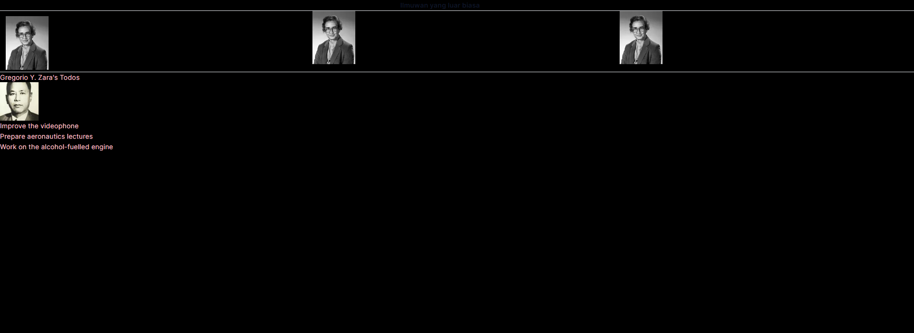
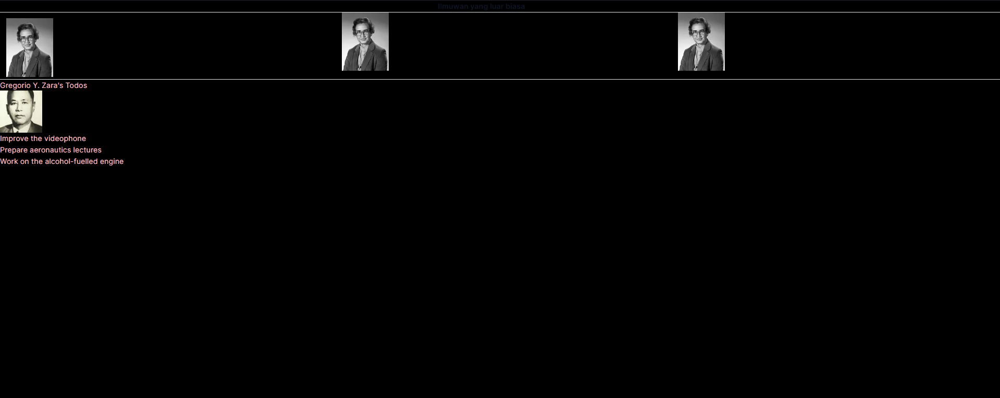
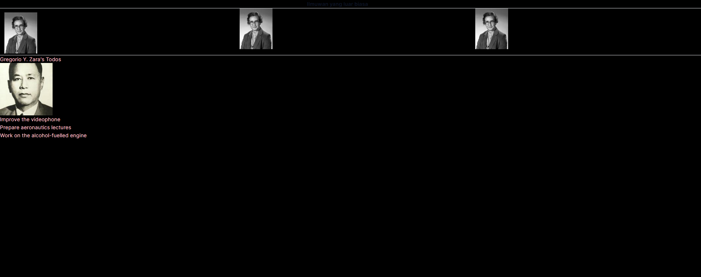
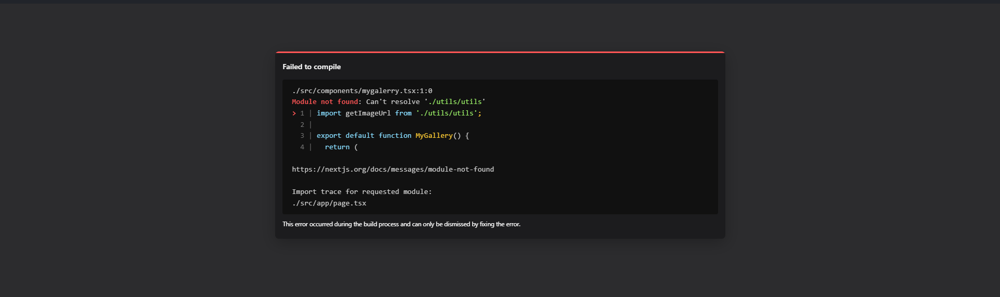
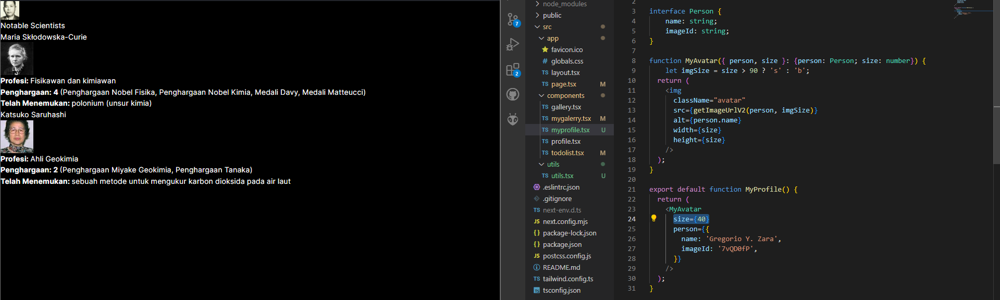
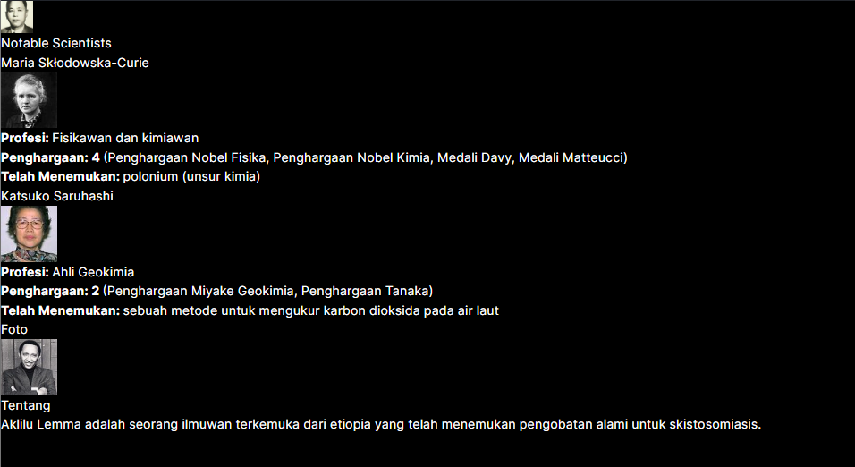

# 03 | Components, JSX, dan Props

## Praktikum 1: Mendefinisikan Komponen

### **Langkah 1: Buat Folder Baru**
Buatlah folder baru bernama `03-belajar-komponen` lalu di dalam folder tersebut, jalankan terminal dengan mengetikkan perintah berikut:

```
npx create-next-app
```

### **Langkah 2: Buat Komponen Baru**
Buatlah folder baru dan file baru di `src/components/profile.tsx` lalu ketik kode berikut ini.

```tsx
import Image from "next/image";

export default function Profile() {
    return (
      <Image
        src="https://i.imgur.com/MK3eW3Am.jpg"
        alt="Katherine Johnson"
        width={100}
        height={100}
        style={{
          maxWidth: "100%",
          height: "auto",
          margin: "13px"
        }}
      />
    );
  }
```

### **Langkah 3: Import Komponen**
Lakukan import komponen `Profile` ke `src/app/page.tsx`

```tsx
import Profile from "../components/profile";
```

>**Soal 1**
>
>Ubah isi kode `Home()` sehingga dapat tampil seperti berikut dengan memanfaatkan komponen `Profile()` yang tadi sudah dibuat dari langkah 1 tersebut!
>
>Capture hasilnya dan buatlah laporan di **README.md**. Jelaskan apa yang telah Anda pelajari dan bagaimana Anda solve error tersebut?
>
>Jangan lupa push dengan pesan commit: `"W03: Jawaban soal 1"`.

Jawab:

Mengubah code pada file `page.tsx`
```tsx
export default function Home() {
  return (
    <main className="flex flex-col items-center">
      <p className="justify-center mt-16">Ilmuwan yang luar biasa</p>

      <div className="flex mt-32">
        <Profile />
        <div className="mx-96">
          <Profile />
        </div>
        <Profile />
      </div>
    </main>
  );
}
```

Output: 


## Praktikum 2: Mengimpor dan Mengekspor Komponen

### **Langkah 1: Buat Komponen Baru**
Buatlah file baru di `src/components/gallery.tsx` berisi kode seperti berikut:
```tsx
import Profile from "./profile";

export function Gallery() {
    return (
        <div className="columns-3">
            <Profile />
            <Profile />
            <Profile />
        </div>
    );
}
```

### **Langkah 2: Impor Komponen**
Lakukan impor komponen di `src/app/page.tsx` seperti berikut ini. Hapus kode komponen lama `Profile`, lalu sesuaikan dengan komponen baru `Gallery` yang telah dibuat.
```tsx
import { Gallery } from "@/components/gallery";
```

>Soal 2
>
>Capture hasilnya dan buatlah laporan di **README.md.** Jelaskan apa yang telah Anda pelajari dan bagaimana tampilannya saat ini?
>
>Jangan lupa push dengan pesan commit: `"W03: Jawaban soal 2"`.

Jawab:

Dengan menambahkan kode pada file page.tsx
```tsx
{ <Gallery /> }
```
Kode diatas berfungsi untuk memanggil komponen Gallery

Output: 


>Soal 3
>
>Silakan perbaiki kode JSX berikut ini. Anda boleh menggunakan konverter atau perbaiki secara manual.
> 
> Capture hasilnya dan buatlah laporan di **README.md.** Jelaskan apa yang telah Anda pelajari dan mengapa error itu bisa terjadi?
>
>Jangan lupa push dengan pesan commit: `"W03: Jawaban soal 3"`.

Jawab:
Kode diatas error karena terdapat expression yang tidak satu parent elemen, dan juga penggunaan class yang harusnya menggunakan className, lalu penutup tag br yang tidak benar dan susuan tag b dan i yang belum rapih

Code:
```tsx
export default function Bio() {
  return (
    <div className="intro">
      <h1>Selamat datang di website saya!</h1>
      <p className="summary">
        Anda dapat membaca uneg-unegku di sini.
        <br /><br />
        <b>Juga ada <i>foto</i> ilmuwan!</b>
      </p>
    </div>
  );
}
```

Output:


## Praktikum 3: Menggunakan JSX dinamis

### **Langkah 1: Buat Komponen Baru**
Buatlah file baru di `src/components/todolist.tsx` berisi kode seperti berikut:
```tsx
const person = {
  name: 'Gregorio Y. Zara',
  theme: {
    backgroundColor: 'black',
    color: 'pink'
  }
};

export default function TodoList() {
  return (
    <div style={person.theme}>
      <h1>{person}'s Todos</h1>
      
      <ul>
        <li>Improve the videophone</li>
        <li>Prepare aeronautics lectures</li>
        <li>Work on the alcohol-fuelled engine</li>
      </ul>
    </div>
  );
}
```

>Soal 4
>
>Kode di atas masih terdapat error, silakan diperbaiki.
>
>Jangan lupa push dengan pesan commit: `"W03: Jawaban soal 4"`.

Jawab:

Terjadi error di kode bagian
```tsx
<h1>{person}'s Todos</h1>
```
karena penggunaan objek dan properti nya tidak lengkap.

Kode yang benar:
```tsx
<h1>{person.name}'s Todos</h1>
```

### **Langkah 2: Impor Komponen**

Lakukan impor komponen di `src/app/page.tsx` seperti berikut ini.

```tsx
import { Gallery } from "@/components/gallery";
import TodoList from "@/components/todolist";

export default function Home() {
  return (
    <section>
      <h1 className="font-semibold text-slate-900 truncate pr-20 text-center">Ilmuwan yang luar biasa</h1>
      <hr />
      <Gallery />
      <hr />
      <TodoList />
    </section>
  );
}
```

>Soal 5
>
>Buka file `src/components/todolist.tsx` lakukan ekstrak URL gambar ke dalam objek `person`.
>
>Capture hasilnya dan buatlah laporan di **README.md.** Apakah ada perbedaan pada tampilan web saat ini?
>
>Jangan lupa push dengan pesan commit: `"W03: Jawaban soal 5"`.

Jawab: 



Tidak ada perbedaan pada tampilan

### **Langkah 3: Ubah ekspresi URL di src**

Tetap di file `src/components/todolist.tsx` ubahlah objek person dan tambah variabel baseUrl seperti di bawah ini. URL lengkap gambar dibagi menjadi empat bagian: URL dasar, `imageId`, `imageSize`, dan ekstensi file.

Kita ingin URL gambar menggabungkan atribut-atribut ini bersama-sama: URL dasar (selalu `'https://i.imgur.com/'`), `imageId ('7vQD0fP')`, `imageSize ('s')`, dan ekstensi file (selalu `'.jpg'`). Namun, ada yang salah dengan atribut `src`.

Bisakah anda memperbaikinya?
```tsx
const baseUrl = 'https://i.imgur.com/';
const person = {
  name: 'Gregorio Y. Zara',
  imageId: '7vQD0fP',
  imageSize: 's',
  theme: {
    backgroundColor: 'black',
    color: 'pink'
  }
};

export default function TodoList() {
  return (
    <div style={person.theme}>
      <h1>{person.name}'s Todos</h1>
      
      <ul>
        <li>Improve the videophone</li>
        <li>Prepare aeronautics lectures</li>
        <li>Work on the alcohol-fuelled engine</li>
      </ul>
    </div>
  );
}
```

>Soal 6
>
>Perbaiki kode tersebut pada bagian atribut `src`. Kode lainnya dapat Anda sesuaikan dari jawaban soal sebelumnya. Capture hasilnya dan buatlah laporan di **README.md**. Jelaskan apa yang telah Anda pelajari dan bagaimana tampilannya saat ini?
>
>Jangan lupa push dengan pesan commit: `"W03: Jawaban soal 6"`.
>
>Catatan:
>
>Untuk memeriksa apakah perbaikan Anda berhasil, coba ubah nilai dari `imageSize` menjadi `'b'`. Gambar harus menyesuaikan ukuran setelah diubah.

Jawab:

terdapat error pada kode yang berupa penulisan url yang tidak tepat
```tsx
src="{baseUrl}{person.imageId}{person.imageSize}.jpg"
```

kode yang benar:
```tsx
src={`${baseUrl}${person.imageId}${person.imageSize}.jpg`}
```
Output:

***Image size s***


***Image size b***


Penggunaan image size 's' dan 'b' memberikan perbedaan ukuran pada gambar


## Praktikum 4: Menggunakan Props

### **Langkah 1: Buat Komponen Baru**
Buatlah file baru di `src/components/mygallery.tsx` berisi kode seperti berikut:
```tsx
import { getImageUrl } from '@/utils/utils';

export default function MyGallery() {
  return (
    <div>
      <h1>Notable Scientists</h1>
      <section className="profile">
        <h2>Maria Skłodowska-Curie</h2>
        
        <ul>
          <li>
            <b>Profesi: </b> 
            Fisikawan dan kimiawan
          </li>
          <li>
            <b>Penghargaan: 4 </b> 
            (Penghargaan Nobel Fisika, Penghargaan Nobel Kimia, Medali Davy, Medali Matteucci)
          </li>
          <li>
            <b>Telah Menemukan: </b>
            polonium (unsur kimia)
          </li>
        </ul>
      </section>
      <section className="profile">
        <h2>Katsuko Saruhashi</h2>
        
        <ul>
          <li>
            <b>Profesi: </b> 
            Ahli Geokimia
          </li>
          <li>
            <b>Penghargaan: 2 </b> 
            (Penghargaan Miyake Geokimia, Penghargaan Tanaka)
          </li>
          <li>
            <b>Telah Menemukan: </b>
            sebuah metode untuk mengukur karbon dioksida pada air laut
          </li>
        </ul>
      </section>
    </div>
  );
}
```

>**Soal 7**
>
>Jika kode di atas terdapat error, silakan diperbaiki.
>
>Komponen `MyGallery` ini berisi dua markup yang sama persis. Ekstraklah menjadi komponen `MyProfile` untuk mengurangi duplikasi. Anda perlu memilih props apa saja yang akan dikirimkan.
>
>Capture hasilnya dan buatlah laporan di **README.md.** Jelaskan apa yang telah Anda pelajari dan bagaimana tampilannya saat ini?
>
>Jangan lupa push dengan pesan commit: `"W03: Jawaban soal 7"`.

Jawab:

Terdapat error pada penggunaan getImageUrl pada @/utils/utils dikarenakan fungsi tersebut akan dibuat pada langkah berikutnya.


 

 ### **Langkah 2: Buat fungsi getImageUrl**

Buatlah file baru di `src/utils/utils.tsx` berisi kode seperti berikut:
```tsx
export function getImageUrl(imageId, size = 's') {
  return (
    'https://i.imgur.com/' +
    imageId +
    size +
    '.jpg'
  );
}
```

### **Langkah 3: Buat komponen baru**
Buatlah file baru di `src/components/myprofile.tsx` berisi kode seperti berikut:
```tsx
import { getImageUrlV2 } from '@/utils/utils';

function MyAvatar({ person, size }) {
  return (
    
  );
}

export default function MyProfile() {
  return (
    <MyAvatar
      size={40}
      person={{ 
        name: 'Gregorio Y. Zara', 
        imageId: '7vQD0fP'
      }}
    />
  );
}
```
Tambahkan fungsi `getImageUrlV2` seperti berikut di file yang sama yaitu `utils.tsx`

**`src/utils/utils.tsx`**
```tsx
export function getImageUrlV2(person, size) {
  return (
    'https://i.imgur.com/' +
    person.imageId +
    size +
    '.jpg'
  );
}
```
Pada contoh ini, komponen `MyAvatar` menerima prop `size` yang berupa angka dan akan digunakan untuk menentukan lebar dan tinggi `< img >`. Prop `size` dibuat `40` pada contoh ini. Bagaimanapun, jika Anda membuka gambar tersebut di web, Anda akan melihat bahwa gambarnya akan lebih besar (`160` piksel). Ukuran gambar yang sebenarnya ditentukan oleh ukuran thumbnail yang Anda minta.

>**Soal 8**
>
>Jika kode di atas terdapat error, silakan diperbaiki.
>
>Ubahlah komponen `MyAvatar` untuk diolah ukuran gambarnya berdasarkan prop `size`. Khususnya, jika `size` kurang dari `90`, kirimkan `'s'` ("small") bukan `'b'` ("big") pada fungsi `getImageUrl`. Pastikan bahwa perubahan yang Anda buat berjalan dengan cara me-render avatars dengan nilai prop `size` yang berbeda dan buka gambar pada tab baru di browser.
>
>Capture hasilnya dan buatlah laporan di **README.md**. Jelaskan apa yang telah Anda pelajari dan bagaimana tampilannya saat ini?
>
>Jangan lupa push dengan pesan commit: `"W03: Jawaban soal 8"`.

Jawab:

Sebelumnya terdapat permasalahan di url gambar, lalu saya merubah penggunaan parameter seperti kode dibawah agar url yang diberikan dapat menghasilkan gambar.
```tsx
function MyAvatar({ person, size }: {person: Person; size: number}) {
    let imgSize = size < 90 ? 's' : 'b';
  return (
    
  );
}
```
Dan untuk menentukan size 's' atau 'b' dari URL gambar, maka dapat digunakan ternary operator dengan merubah value angka seperti gambar dibawah ini.




### **Langkah 4: Buat komponen baru MyProfileV2**
Buatlah file baru di `src/components/myprofilev2.tsx` berisi kode seperti berikut:

```tsx
export default function MyProfileV2() {
  return (
    <div>
      <div className="card">
        <div className="card-content">
          <h1>Foto</h1>
          
        </div>
      </div>
      <div className="card">
        <div className="card-content">
          <h1>Tentang</h1>
          <p>Aklilu Lemma adalah seorang ilmuwan terkemuka dari etiopia yang telah menemukan pengobatan alami untuk skistosomiasis.</p>
        </div>
      </div>
    </div>
  );
}
```

>**Soal 9**
>
>Jika kode di atas terdapat error, silakan diperbaiki.
>
>Buatlah komponen `Card` dari kode di atas, lalu gunakan prop `children` untuk mengirimkan JSX yang berbeda.
>
>Capture hasilnya dan buatlah laporan di **README.md**. Jelaskan apa yang telah Anda pelajari dan bagaimana tampilannya saat ini?
>
>Jangan lupa push dengan pesan commit: `"W03: Jawaban soal 9"`.

Jawab:



Dengan membuat function Card, penulisan tag yang berulang seperti card tersebut, dapat ditulis sekali saja dalam function, kemudian dengan function tersebut, komponen yang sama dapat digunakan diparent dengan penulisan yang lebih singkat.