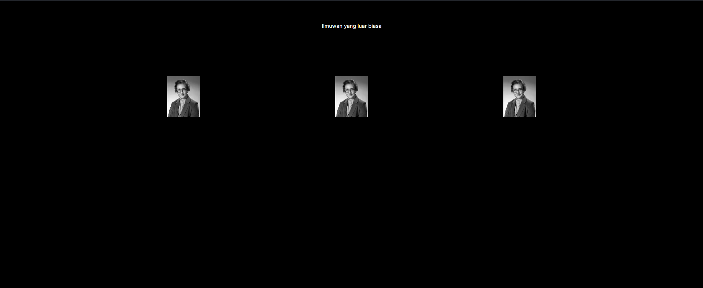
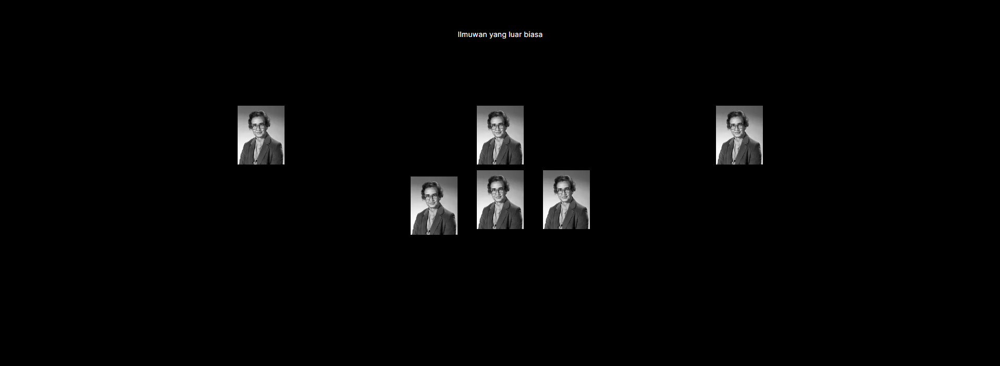
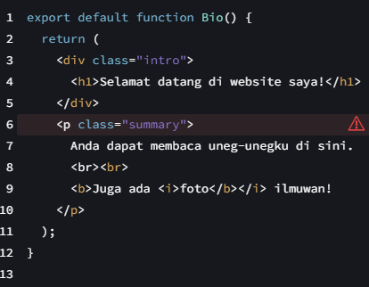
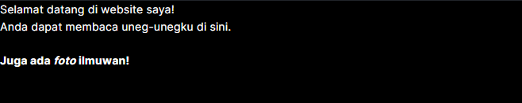

# 03 | Components, JSX, dan Props

## Praktikum 1: Mendefinisikan Komponen

### **Langkah 1: Buat Folder Baru**
Buatlah folder baru bernama `03-belajar-komponen` lalu di dalam folder tersebut, jalankan terminal dengan mengetikkan perintah berikut:

```
npx create-next-app
```

### **Langkah 2: Buat Komponen Baru**
Buatlah folder baru dan file baru di `src/components/profile.tsx` lalu ketik kode berikut ini.

```tsx
import Image from "next/image";

export default function Profile() {
    return (
      <Image
        src="https://i.imgur.com/MK3eW3Am.jpg"
        alt="Katherine Johnson"
        width={100}
        height={100}
        style={{
          maxWidth: "100%",
          height: "auto",
          margin: "13px"
        }}
      />
    );
  }
```

### **Langkah 3: Import Komponen**
Lakukan import komponen `Profile` ke `src/app/page.tsx`

```tsx
import Profile from "../components/profile";
```

>**Soal 1**
>
>Ubah isi kode `Home()` sehingga dapat tampil seperti berikut dengan memanfaatkan komponen `Profile()` yang tadi sudah dibuat dari langkah 1 tersebut!
>
>Capture hasilnya dan buatlah laporan di **README.md**. Jelaskan apa yang telah Anda pelajari dan bagaimana Anda solve error tersebut?
>
>Jangan lupa push dengan pesan commit: `"W03: Jawaban soal 1"`.

Jawab:

Mengubah code pada file `page.tsx`
```tsx
export default function Home() {
  return (
    <main className="flex flex-col items-center">
      <p className="justify-center mt-16">Ilmuwan yang luar biasa</p>

      <div className="flex mt-32">
        <Profile />
        <div className="mx-96">
          <Profile />
        </div>
        <Profile />
      </div>
    </main>
  );
}
```

Output: 



## Praktikum 2: Mengimpor dan Mengekspor Komponen

### **Langkah 1: Buat Komponen Baru**
Buatlah file baru di `src/components/gallery.tsx` berisi kode seperti berikut:
```tsx
import Profile from "./profile";

export function Gallery() {
    return (
        <div className="columns-3">
            <Profile />
            <Profile />
            <Profile />
        </div>
    );
}
```

### **Langkah 2: Impor Komponen**
Lakukan impor komponen di `src/app/page.tsx` seperti berikut ini. Hapus kode komponen lama `Profile`, lalu sesuaikan dengan komponen baru `Gallery` yang telah dibuat.
```tsx
import { Gallery } from "@/components/gallery";
```

>Soal 2
>
>Capture hasilnya dan buatlah laporan di **README.md.** Jelaskan apa yang telah Anda pelajari dan bagaimana tampilannya saat ini?
>
>Jangan lupa push dengan pesan commit: `"W03: Jawaban soal 2"`.

Jawab:

Dengan menambahkan kode pada file page.tsx
```tsx
{ <Gallery /> }
```
Kode diatas berfungsi untuk memanggil komponen Gallery

Output: 



>Soal 3
>
>Silakan perbaiki kode JSX berikut ini. Anda boleh menggunakan konverter atau perbaiki secara manual.
> 
> Capture hasilnya dan buatlah laporan di **README.md.** Jelaskan apa yang telah Anda pelajari dan mengapa error itu bisa terjadi?
>
>Jangan lupa push dengan pesan commit: `"W03: Jawaban soal 3"`.

Jawab:
Kode diatas error karena terdapat expression yang tidak satu parent elemen, dan juga penggunaan class yang harusnya menggunakan className, lalu penutup tag br yang tidak benar dan susuan tag b dan i yang belum rapih

Code:
```tsx
export default function Bio() {
  return (
    <div className="intro">
      <h1>Selamat datang di website saya!</h1>
      <p className="summary">
        Anda dapat membaca uneg-unegku di sini.
        <br /><br />
        <b>Juga ada <i>foto</i> ilmuwan!</b>
      </p>
    </div>
  );
}
```

Output:

