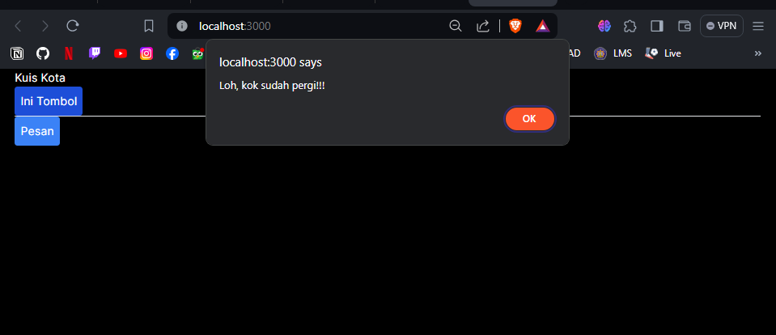
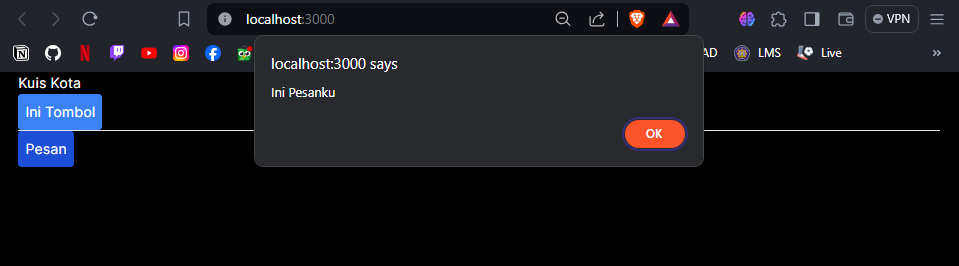
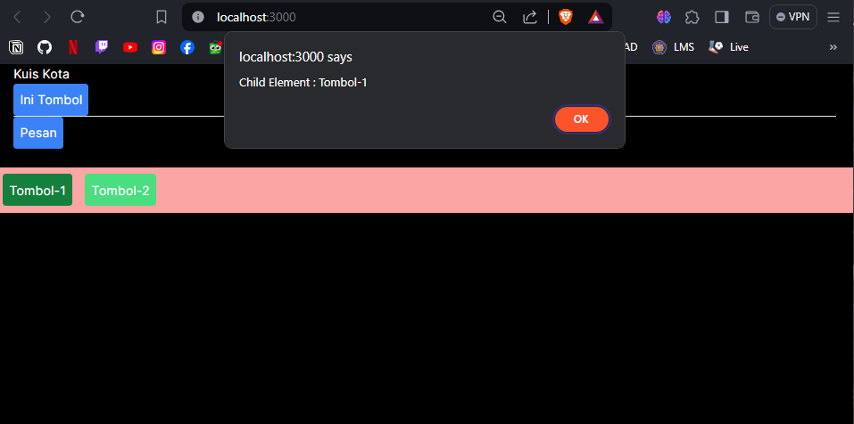
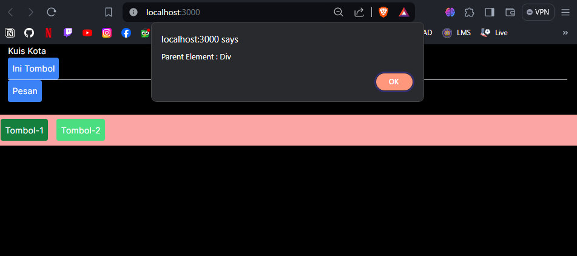

# 04 | Event dan State

## Praktikum 1: Event Handler

### **Langkah 1**
Kita mencoba membuat tombol sederhana yang belum bisa melakukan apa-apa alias belum kita buat event handler untuk tombol tersebut. Sebagai contoh, berikut adalah sebuah tombol yang belum melakukan apa pun. Kita buat folder/file baru di `src/component/button.tsx`

```tsx
export default function Tombol_1() {
    return (
        <button className="bg-blue-500 hover:bg-blue-700 text-white p-2 rounded">
            Ini tombol
        </button>
    );
}
```
Selanjutnya pada file `src/app/page.tsx` kita ubah menjadi seperti berikut

```tsx
import Tombol_1 from "@/components/button";

export default function Home() {
    return (
        <>
            <div className="container mx-auto">
                <h2>Kuis Kota</h2>
                <Tombol_1/>
            </div>
        </>
    );
}
```
Kemudian kita jalankan perintah `"npm run dev"` dan kita buka alamat `localhost:3000` pada browser. Maka akan tampil hasil seperti berikut

Output: 


### **Langkah 2**
Kita bisa menambahkan event pada tombol tersebut. Seperti contoh kita buat ketika tombol di klik, akan memunculkan notif/alert. Kita dapat membuat pesan ketika pengguna mengeklik dengan mengikuti tiga langkah berikut:<p>
    1. Deklarasikan sebuah fungsi bernama `handleClick` di dalam komponen Button kita.<p>
    2. Implementasikan logika di dalam fungsi tersebut (gunakan `alert` untuk menampilkan pesan)<p>
    3. Tambahkan handler `onClick={handleClick}` ke tag JSX `< button >`<p>

Perhatikan kode `button.tsx` berikut
```tsx
export default function Tombol_1() {
    // mnambahkan fungsi untuk menangani klik tomnol
    function handleClick() {
        alert("Tombol telah ditekan!!!");
    }

    function handleMouseOver() {
        alert("Eits, mau mencet tombol ya?");
    }

    return (
        <button
            className="bg-blue-500 hover:bg-blue-700 text-white p-2 rounded"
            onClick={handleClick}
            onMouseOver={handleMouseOver}
        >
            Ini Tombol
        </button>
    )
}
```
Jika terjadi error seperti gambar berikut


Maka kita butuh mengatur agar komponen yang kita gunakan menjadi komponen client. Untuk menjadikan komponen client, kita cukup memberikan perintah ini `"use client";` pada baris pertama file `page.tsx`
```tsx
"use client";
import Tombol_1 from "@/components/button";

export default function Home() {
```

Kita mendefinisikan fungsi `handleClick` dan kemudian mengopernya sebagai prop ke `< button >`. Method `handleClick` adalah sebuah event handler pada tombol tersebut.

Nama Method event handler sebaiknya memiliki format tertentu, seperti contoh memiliki nama yang diawali dengan kata `handle`, diikuti oleh nama event yang akan dilakukan. Contoh

- event handler untuk menangani ketika ada event klik tombol `onClick={handleClick}`,
- event handler untuk menangani ketika ada event `onMouseEnter={handleMouseEnter}`, dan lain sebagainya.

Selain itu, sebagai alternatif, Kita juga dapat mendefinisikan event handler secara inline dalam JSX secara langsung seperti berikut
```tsx
return (
        <button
            className="bg-blue-500 hover:bg-blue-700 text-white p-2 rounded"
            onClick={handleClick}
            // onMouseOver={handleMouseOver}
            onMouseLeave={() => {
                alert("Loh, kok sudah pergi!!!")
                }
            }
        >
            Ini Tombol
        </button>
    );
```
**Ingat!**

Method event handle **HARUS** dioper (ditulis nama fungsinya, tanpa tanda kurung `()`), bukan dipanggil */call* (nama fungsi ditulis dengan tanda kurung `()`). Contoh:
>Fungsi di oper **(benar)**

> ```< button onClick={handleClick} >```

> Fungsi dipanggil */call* (**salah**)

> ```< button onClick={handleClick()} >```

Perbedaannya tipis. Pada contoh pertama, fungsi `handleClick` dioper sebagai event handler `onClick`. Ini memberitahu React untuk mengingatnya dan hanya memanggil fungsi tersebut ketika pengguna mengeklik tombolnya.

Pada contoh kedua, tanda () di akhir `handleClick()` akan menjalankan fungsi tersebut langsung saat proses render, tanpa adanya klik. Ini karena JavaScript di dalam tag JSX { dan } dieksekusi secara langsung.

Silahkan *di commit untuk Praktikum 1*

### **Praktikum 2**

Kita buat fungsi baru pada component `button.tsx`
```tsx
export function Tombol_2({isiPesan, namaTombol}) {
    return (
        <button
            className="bg-blue-500 hover:bg-blue-700 text-white p-2 rounded"
            onClick={() => alert(isiPesan)}>
            {namaTombol}
        </button>
    );
}
```

**Ingat!**

Pada component, hanya ada 1 fungsi yang memiliki `default` !

Parameter `isiPesan` dan `namaTombol` bisa diisi oleh layout yang ada di `page.tsx` nanti, sehingga komponen `Tombol_2` bernilai dinamis.

Sekarang kita modifikasi file `page.tsx` seperti berikut
```tsx
"use client";
import Tombol_1, { Tombol_2 } from "@/components/button";

export default function Home() {
    return (
        <>
          <div className="container mx-auto">
              <h2>Kuis Kota</h2>
              <Tombol_1/>
              <hr></hr>
              <Tombol_2 isiPesan="Ini Pesanku" namaTombol="Pesan" />
          </div>
        </>
    );
}
```

Coba cek di browser dan amati apa yang terjadi?




Jelaskan mengapa bisa seperti itu?

Karena kita menambahkan komponen baru pada file `button.tsx` dan parameter yang ada pada komponen baru tersebut diisi oleh layout yang ada di file `page.tsx` sehingga komponen baru tersebut bernilai dinamis

Silahkan *di commit untuk Praktikum 2*

### **Praktikum 3**
**Langkah 1 - Propagation**
Sebagai contoh coba kita modifikasi file `button.tsx` seperti berikut
```tsx
export function Tombol_2({isiPesan, namaTombol}) {
    return (
        <button
            className="bg-blue-500 hover:bg-blue-700 text-white p-2 rounded"
            onClick={() => alert(isiPesan)}>
            {namaTombol}
        </button>
    );
}

export function Tombol_3({isiPesan, namaTombol}) {
    return (
        <button
            className="bg-green-400 hover:bg-green-700 text-white p-2 rounded m-2"
            onClick={() => alert(isiPesan)}>
            {namaTombol}
        </button>
    );
}
```
Kemudian kita modifikasi fiile `page.tsx`
```tsx
"use client";
import Tombol_1, { Tombol_2, Tombol_3 } from "@/components/button";

export default function Home() {
    return (
        <>
          <div className="container mx-auto">
              <h2>Kuis Kota</h2>
              <Tombol_1/>
              <hr></hr>
              <Tombol_2 isiPesan="Ini Pesanku" namaTombol="Pesan" />
          </div>
              <br></br>
          <div className="bg-red-300" onClick={() => alert('Parent Element : Div')}>
            <Tombol_3 isiPesan="Child Element : Tombol-1" namaTombol="Tombol-1" />
            <Tombol_3 isiPesan="Child Element : Tombol-2" namaTombol="Tombol-2" />
          </div>
        </>
    );
}
```

Kemudian kita jalankan di browser, coba klik **Tombol-1**, dan amati apa yang terjadi...!!!




Kita akan disuguhkan dengan pesan/alert sebanyak 2 kali, yaitu Pesan ***"Child Element : Tombol-1"*** dan pesan ***"Parent Element : Div"***.

Hal ini terjadi karena baik untuk element **div** maupun **button** memiliki event yang sama yaitu onClick, sehingga ketika button diklik maka event handler untuk onClick pada button akan dijalankan. Kemudian baru event handler dari parent (element div) akan dijalankan.

Hal ini disebut dengan propagation, dan biasa terjadi pada elemen child dan parent yang memiliki event yang sama.
<br>
<br>
<br>
**Menghentikan Propagation**

*Event handler* menerima sebuah **objek event** sebagai satu-satunya argumen/parameter. Berdasarkan konvensi, objek tersebut biasanya ditulis **e** yang merupakan kepanjangan dari *"event"*. Anda dapat menggunakan objek ini untuk membaca informasi tentang event tersebut.

Objek event tersebut juga dapat memungkinkan untuk menghentikan propagasi. Jika kita ingin mencegah sebuah event untuk mencapai komponen induknya *(propagation)*, Kita harus memanggil e.stopPropagation() untuk mencegah propagasi.

**Langkah 2 - Stop Propagation**
```tsx
export function Tombol_3({isiPesan, namaTombol}) {
    return (
        <button
            className="bg-green-400 hover:bg-green-700 text-white p-2 rounded m-2"
            onClick={(e) => {
                    e.stopPropagation();
                    alert(isiPesan)
                }
            }>
            {namaTombol}
        </button>
    );
}
```