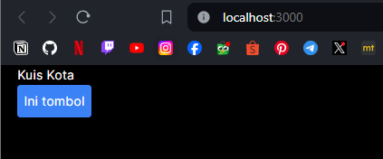
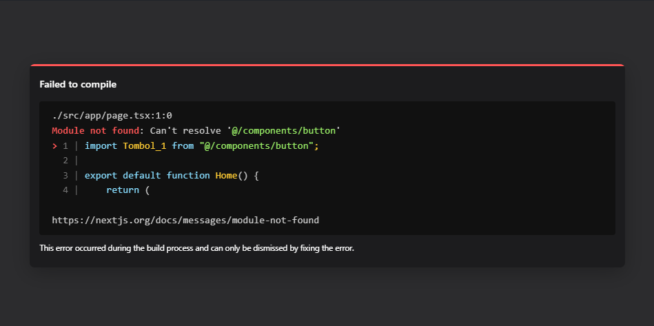

# 04 | Event dan State

## Praktikum 1: Event Handler

### **Langkah 1**
Kita mencoba membuat tombol sederhana yang belum bisa melakukan apa-apa alias belum kita buat event handler untuk tombol tersebut. Sebagai contoh, berikut adalah sebuah tombol yang belum melakukan apa pun. Kita buat folder/file baru di `src/component/button.tsx`

```tsx
export default function Tombol_1() {
    return (
        <button className="bg-blue-500 hover:bg-blue-700 text-white p-2 rounded">
            Ini tombol
        </button>
    );
}
```
Selanjutnya pada file `src/app/page.tsx` kita ubah menjadi seperti berikut

```tsx
import Tombol_1 from "@/components/button";

export default function Home() {
    return (
        <>
            <div className="container mx-auto">
                <h2>Kuis Kota</h2>
                <Tombol_1/>
            </div>
        </>
    );
}
```
Kemudian kita jalankan perintah `"npm run dev"` dan kita buka alamat `localhost:3000` pada browser. Maka akan tampil hasil seperti berikut

Output: 


### **Langkah 2**
Kita bisa menambahkan event pada tombol tersebut. Seperti contoh kita buat ketika tombol di klik, akan memunculkan notif/alert. Kita dapat membuat pesan ketika pengguna mengeklik dengan mengikuti tiga langkah berikut:<p>
    1. Deklarasikan sebuah fungsi bernama `handleClick` di dalam komponen Button kita.<p>
    2. Implementasikan logika di dalam fungsi tersebut (gunakan `alert` untuk menampilkan pesan)<p>
    3. Tambahkan handler `onClick={handleClick}` ke tag JSX `< button >`<p>

Perhatikan kode `button.tsx` berikut
```tsx
export default function Tombol_1() {
    // mnambahkan fungsi untuk menangani klik tomnol
    function handleClick() {
        alert("Tombol telah ditekan!!!");
    }

    function handleMouseOver() {
        alert("Eits, mau mencet tombol ya?");
    }

    return (
        <button
            className="bg-blue-500 hover:bg-blue-700 text-white p-2 rounded"
            onClick={handleClick}
            onMouseOver={handleMouseOver}
        >
            Ini Tombol
        </button>
    )
}
```
Jika terjadi error seperti gambar berikut


Maka kita butuh mengatur agar komponen yang kita gunakan menjadi komponen client. Untuk menjadikan komponen client, kita cukup memberikan perintah ini `"use client";` pada baris pertama file `page.tsx`
```tsx
"use client";
import Tombol_1 from "@/components/button";

export default function Home() {
```

Kita mendefinisikan fungsi `handleClick` dan kemudian mengopernya sebagai prop ke `< button >`. Method `handleClick` adalah sebuah event handler pada tombol tersebut.

Nama Method event handler sebaiknya memiliki format tertentu, seperti contoh memiliki nama yang diawali dengan kata `handle`, diikuti oleh nama event yang akan dilakukan. Contoh

- event handler untuk menangani ketika ada event klik tombol `onClick={handleClick}`,
- event handler untuk menangani ketika ada event `onMouseEnter={handleMouseEnter}`, dan lain sebagainya.

Selain itu, sebagai alternatif, Kita juga dapat mendefinisikan event handler secara inline dalam JSX secara langsung seperti berikut
```tsx
return (
        <button
            className="bg-blue-500 hover:bg-blue-700 text-white p-2 rounded"
            onClick={handleClick}
            // onMouseOver={handleMouseOver}
            onMouseLeave={() => {
                alert("Loh, kok sudah pergi!!!")
                }
            }
        >
            Ini Tombol
        </button>
    );
```
**Ingat!**

Method event handle **HARUS** dioper (ditulis nama fungsinya, tanpa tanda kurung `()`), bukan dipanggil */call* (nama fungsi ditulis dengan tanda kurung `()`). Contoh:
>Fungsi di oper **(benar)**

> ```< button onClick={handleClick} >```

> Fungsi dipanggil */call* (**salah**)

> ```< button onClick={handleClick()} >```

Perbedaannya tipis. Pada contoh pertama, fungsi `handleClick` dioper sebagai event handler `onClick`. Ini memberitahu React untuk mengingatnya dan hanya memanggil fungsi tersebut ketika pengguna mengeklik tombolnya.

Pada contoh kedua, tanda () di akhir `handleClick()` akan menjalankan fungsi tersebut langsung saat proses render, tanpa adanya klik. Ini karena JavaScript di dalam tag JSX { dan } dieksekusi secara langsung.

Silahkan *di commit untuk Praktikum 1*