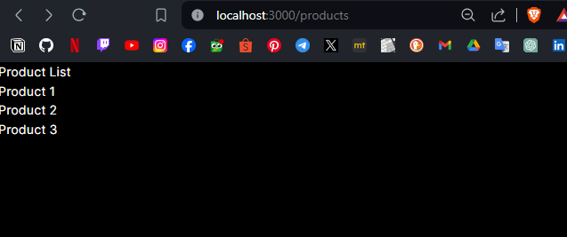
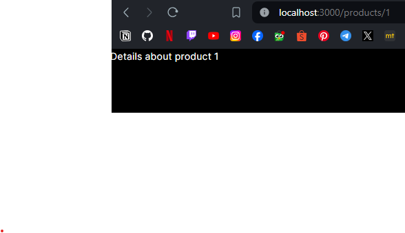
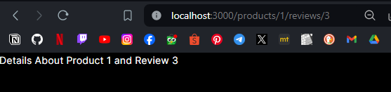
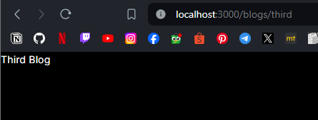

# 05 | Routing

## Praktikum 1: Membuat routing sederhana

Pada praktikum ini, Anda akan membuat 3 halaman yang di-handle oleh router, yaitu halaman `home`, halaman `about`, dan halaman `profile`. Silakan lakukan langkah-langkah praktikum berikut ini.

1. Persiapkan project dengan memanfaatkan template repository yang telah dipersiapkan di alamat [https://github.com/dhanifudin/routing-demo](https://github.com/dhanifudin/routing-demo) dan gunakan tombol **Use this template** kemudian pilih **Create a new repository**.
2. Clone project ke lokal laptop anda dan lakukan instalasi dependencies dengan menjalankan perintah berikut.
```
npm install
```
3. Silahkan buka project tersebut dengan menggunakan VSCode dan perhatikan file yang ada dalam folder app.
4. Routing di ReactJS dengan NextJS memanfaatkan organisasi penamaan folder dan file pada folder app. Silahkan tambahkan file page.tsx di dalam folder app, dan buatlah komponen dengan kode berikut.
```tsx
export default function Home() {
  return <h1>Welcome to Home</h1> ;
}
```
5. alankan project dengan menggunakan perintah npm run dev di terminal VSCode. Dan silahkan buka browser pada alamat url [http://localhost:3000](http://localhost:3000)
6.  pada project di VSCode, akan terdapat sebuah file yang akan digenerate yaitu layout.tsx. File ini akan secara otomatis digenerate jika tidak ditemukan. Perhatikan susunan kode yang ada di dalamnya. Anda akan menemukan susunan html yang di dalamnya terdapat props children. Props children akan direplace oleh komponen sesuai dengan routing.
7. Untuk membuat halaman routing /about dengan NextJS, silahkan buat folder /about dalam /app dan buat file dengan nama page.tsx. Kemudian buat function komponen seperti pada kode berikut.
8. Lakukan commit ke project setelah menyelesaikan semua Praktikum 1. Jangan lupa untuk mendokumentasikan dengan tangkapan layar dan menyimpan di folder /images di project anda.
```tsx
export default function About() {
  return <h1>Welcome to About</h1> ;
}
```
>**Todo**: Buatlah halaman /profile yang menampilkan isi biodata anda dengan menggunakan routing di NextJS.

Output about/page.tsx


Output profile/page.tsx


## Praktikum 2: Membuat routing bersarang (Nested Routing)

Anda dapat membuat routing bersarang, maksudnya ketika suatu link diklik di dalam link tersebut terdapat daftar link atau menu yang dapat diklik juga. Jadi, dalam praktikum ini akan dibuat susunan URL atau link seperti berikut:

**Link utama** &nbsp; &nbsp; &nbsp; &nbsp; &nbsp; **Link bersarang**

---
/ 

---
/about

---
/blogs &nbsp; &nbsp; &nbsp; &nbsp; &nbsp; &nbsp; &nbsp; &nbsp; &nbsp; &nbsp; /blogs/first

---
/blogs &nbsp; &nbsp; &nbsp; &nbsp; &nbsp; &nbsp; &nbsp; &nbsp; &nbsp; &nbsp; /blogs/second

---

Untuk memahaminya, silakan lakukan langkah-langkah praktikum berikut ini:

1. Dengan menggunakan konsep yang sama pada Praktikum 1, silahkan tambahkan susunan folder /blogs/first dan /blogs/second. Kemudian tambahkan masing-masing untuk setiap folder dengan file page.tsx.
2. Pada file /blogs/page.tsx buatlah function component seperti kode berikut atau anda dapat mengkreasikan tampilan dengan selera anda!
```tsx
export default function Blog() {
  return (
        <h1>Blog</h1>
  );
}
```
3. Pada file /blogs/first/page.tsx buatlah function component seperti berikut:
```tsx
export default function FirstBlog() {
  return (
        <h1>First Blog</h1>
  );
}
```
4. Cobalah akses halaman /blogs dan /blogs/first pada browser anda.

>Todo: Lengkapi function component pada /blogs/second/page.tsx

5. Lakukan commit ke project setelah melengkapi semua Praktikum 2 dan dokumentasikan hasil pengerjaan praktikum dengan tangkapan layar.

>Pertanyaan: Apa kekurangan yang mungkin terjadi jika menggunakan pendekatan pada Praktikum 2 untuk menangani routing?

Output blogs/page.tsx


Output blogs/first/page.tsx


Output blogs/second/page.tsx


Jawab: 

Kekurangan yang mungkin terjadi jika menggunakan routing link bersarang adalah kompleksitas dan kerumitan dalam mengelola dan memahami struktur routing yang bersarang, saat aplikasi semakin berkembang dan memiliki banyak tingkatan routing yang bersarang, mungkin akan sulit untuk melacak dan memahami bagaimana setiap link saling terhubung.


## Praktikum 3: Membuat routing dinamis (Dynamic Routing)

Anda dapat membuat routing secara dinamis, maksudnya ketika suatu link diakses akan ditambahkan dengan suatu url path yang nilainya dapat berubah secara dinamis. Jadi, dalam praktikum ini akan dibuat susunan URL atau link seperti berikut:

**Link utama** &nbsp; &nbsp; &nbsp; &nbsp; &nbsp; **Link dinamis**

---
/products &nbsp; &nbsp; &nbsp; &nbsp; &nbsp; &nbsp; &nbsp; &nbsp;/products/1

---
/products &nbsp; &nbsp; &nbsp; &nbsp; &nbsp; &nbsp; &nbsp; &nbsp;/products/2

---
/products &nbsp; &nbsp; &nbsp; &nbsp; &nbsp; &nbsp; &nbsp; &nbsp;/products/3

---
Untuk memahaminya, silakan lakukan langkah-langkah praktikum berikut ini:

1. Buatlah file `/products/page.tsx` yang berisi function component untuk menampilkan list dari products seperti kode berikut.
```tsx
export default function ProductList() {
  return (
        <div>
          <h1>Product List</h1>
          <h2>Product 1</h2>
          <h2>Product 2</h2>
          <h2>Product 3</h2>
        </div>
  );
}
```
2. Untuk mendefinisikan url path di NextJs menggunakan konvensi penamaan direktori dengan mengapit nama path dengan simbol `[ ]`. Sebagai contoh: `[productId]` menandakan bahwa path dinamis menggunakan variabel `productId` (Catatan: Anda boleh menuliskan hanya dengan `[id]`, tetapi untuk mempermudah pembacaan konteks sebaiknya jangan gunakan hanya `id`).
3. Kemudian buatlah file `page.tsx` pada lokasi `/app/products/[productId]` dan tambahkan kode sebagai berikut.
```tsx
type Props = {
  params: {
        productId: string
  }
}

export default function ProductDetails({ params }: Props) {
  return (
        <h1>Details about product {params.productId}</h1>
  )
}
```
4. Untuk mendapatkan nilai path, anda dapat menggunakan pemanggilan `params.productId`. Pemanggilan atribut `params`, disesuaikan dengan pendefinisian nama path.
5. Cobalah akses halaman `/product`s dan `/products/1` pada browser anda. Ubah nilai `productId` dengan nilai lainnya.

>**Todo 1**: Perbaiki implementasi Praktikum 2 menggunakan *Dynamic Routes*

>**Todo 2**: Dengan menggunakan konsep Nested Routes dan Dynamic Routes, buatlah halaman dengan routing `/products/[productId]/reviews/[reviewId]`

6. **Lakukan commit ke project setelah melengkapi semua Praktikum 3** dan dokumentasikan hasil pengerjaan praktikum dengan tangkapan layar.

Output products/page.tsx



Output products/1.tsx



Output products/1.tsx


Output products/1/reviews/3.tsx



Output Perbaiki implementasi Praktikum 2 menggunakan Dynamic Routes

