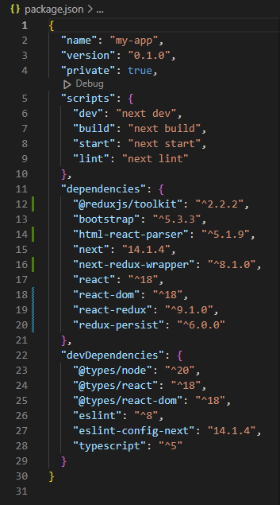
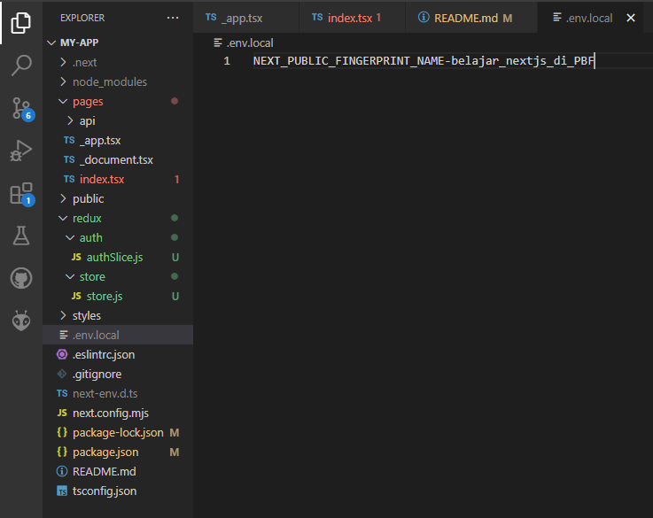
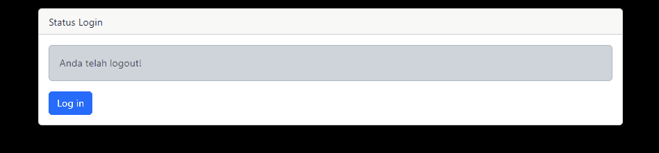
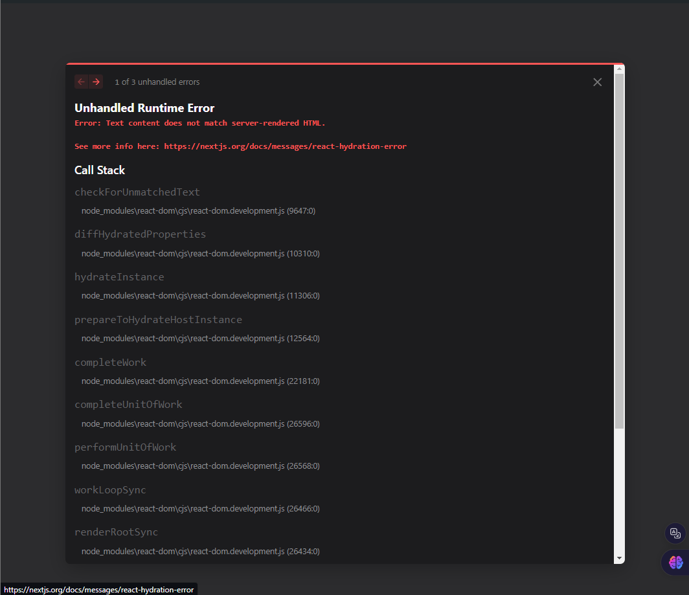

# 06 | React Redux

## Praktikum 1: Instalasi Redux dan bootstrap

> **INFO**
>
> Kita install project *next.js* **baru**, karena kita tidak menggunakan default App Router. Kita buat project baru dengan nama `pertemuan-06` pada repo PBF kita.


Kita buka open folder untuk project `pertemuan-06` di VS Code, maka isi direktori yang ada di dalamnya sedikit berbeda dengan project yang sudah pernah kita buat sebelumnya. Yaitu terdapat folder **`pages`** dan **`styles`**.

Kali ini kita coba pakai CSS Library Bootstrap dengan menjalankan perintah
```
npm install bootstrap
```


Kemudian kita import bootstrap pada aplikasi `next.js` kita. Kita edit file `pages/_app.tsx`

```tsx
import "bootstrap/dist/css/bootstrap.min.css";
import "@/styles/globals.css";
import { useEffect } from "react";

function MyApp({Component, pageProps}:any) {
  useEffect(()=>{
    require("bootstrap/dist/js/bootstrap.bundle.min.js");
  },[]);
 
    return <Component {...pageProps} />;
}

export default MyApp;
```

Sekarang kita perlu mencoba implementasi bootstrap pada project next.js kita.

Contoh kita edit file `pages/index.tsx` menjadi seperti ini
```tsx
export default function Home() {
  return (      
    <div className="container">
      <div className="row">
        <div className="col-12">
          <button type="button"
                  className="btn btn-primary"
                  data-bs-toggle="modal"
                  data-bs-target="#exampleModal">
                  Coba Model Bootstrap
          </button>
        </div>
      </div>
      <div  className="modal fade"
            id="exampleModal"
            tabIndex="-1"
            aria-labelledby="exampleModalLabel"
            aria-hidden="true">
        <div className="modal-dialog">
          <div className="modal-content">
            <div className="modal-header">
              <h5 className="modal-title text-black" id="exampleModalLabel"> yay... </h5>
              <button
                type="button"
                className="btn-close"
                data-bs-dismiss="modal"
                aria-label="Close"></button>
            </div>
            <div className="modal-body text-black">
              <h2>Halo semua, kita sedang menggunakan bootstrap di Next.js</h2>
            </div>
          </div>
        </div>
      </div>
    </div>
  );
}
```

> Coba kita jalankan project next.js kita, dan laporkan apa yang terjadi?


## Praktikum 2: Contoh Login dengan Redux

Komponen yang digunakan pada praktikum kali ini adalah *redux-toolkit* dan *redux-persistent* sehingga kita perlu menginstall-nya
```
npm i --save redux-persist react-redux @reduxjs/toolkit
```
Selanjutnya kita install wrapper untuk redux di next.js
```
npm i --save next-redux-wrapper
```
Selain itu, kita akan menggunakan html parser yang ada di react. Hal ini kita gunakan untuk memparsing html string menjadi sebuah html page
```
npm install html-react-parser
```
Setelah berhasil menginstal kita cek di file `package.json` apakah library sudah ada



Selanjutnya, kita buat folder dengan nama redux yang sejajar dengan folder `public`

Kemudian kita buat file `redux/auth/authSlice.js` seperti berikut
```tsx
import {
    createSlice
} from '@reduxjs/toolkit';

export const initialState = {
    isLogin: true,
};

const authSlice = createSlice({
    name: 'auth',
    initialState,
    reducers: {
        setLogin(state, action) {
            //state?.isLogin = action?.payload?.isLogin;
            if (action && action.payload && typeof action.payload.isLogin !== 'undefined') {
                state.isLogin = action.payload.isLogin;
                isLogin = state.isLogin;
            }
        },
    },
});
export const {
    setLogin
} = authSlice.actions;
const authReducer = authSlice.reducer
export default authReducer;
```

Selanjutnya kita buat file `redux/store/store.js` seperti berikut
```tsx
import { combineReducers, configureStore } from '@reduxjs/toolkit';
import authReducer from '../auth/authSlice';
import storage from 'redux-persist/lib/storage';
import { persistStore, persistReducer, FLUSH, REHYDRATE, PAUSE, PERSIST, PURGE, REGISTER } from 'redux-persist';

const persistConfig = {
   key: process.env.NEXT_PUBLIC_FINGERPRINT_NAME,   // simpan config di file .env.local
   storage,
   whitelist: ['auth'],
};

const rootReducer = combineReducers({
   auth: authReducer,
});

const persistedReducer = persistReducer(persistConfig, rootReducer);
const store = configureStore({
   reducer: persistedReducer,
   middleware: (getDefaultMiddleware) =>
      getDefaultMiddleware({
         serializableCheck: {
            ignoredActions: [FLUSH, REHYDRATE, PAUSE, PERSIST, PURGE, REGISTER],
         },
      }),
});

const persistor = persistStore(store);
export { store, persistor };
```

*Key* pada `persistConfig` kita simpan pada file `.env.local` dengan tujuan agar konfigurasi lebih mudah dan aman. Sehingga jika belum ada file `.env.local`, kita buat dahulu



Selanjutnya, kita buat file baru di `pages/login.tsx`, dan kita tulis kode berikut
```tsx
import { useDispatch,useSelector } from "react-redux";
import {setLogin} from '../redux/auth/authSlice';
import "bootstrap/dist/css/bootstrap.min.css";
import parse from 'html-react-parser';


export default function LoginCheck(){
    const {isLogin} = useSelector((state)=>state.auth);
    const dispatch = useDispatch();

    function handleAuth(type = 'logout'){
        if(type === 'logout' || type === 'login'){
            dispatch(setLogin({isLogin:type === 'login'?true:false}));
        }
    }

    return(
        <div className="container">
            <div className="row">
                <div className="col-12">
                    <div className="card mt-3">
                        <div className="card-header">Status Login</div>
                        <div className="card-body">
                            {isLogin?
                            [
                                parse('<div className="alert alert-success">Yay, berhasil login!!!</div>'),
                                <button className="btn btn-md btn-danger" onClick={()=> handleAuth('logout')}>Log out</button>
                            ]
                            :
                            [
                                parse('<div className="alert alert-dark">Anda telah logout!</div>'),
                                <button className="btn btn-md btn-primary" onClick={() => handleAuth('login')}>Log in</button>
                            ]
                            }
                        </div>
                    </div>
                </div>
            </div>
        </div>
    )
}
```
Jalankan project kita di browser, dan amati apa yang terjadi?

> **Soal**
>
> 1. Coba akses http://localhost:3000/login, dan klik tombol login. Kemudian lakukan refresh page berkali-kali (jika perlu restart npm run dev nya). Simpulkan apa yang terjadi ?
>
> 2. Baris 25 dan 30 terdapat method parse(), apa yang terjadi jika kita tidak menggunakan method tersebut?

Jawab:

Soal 1



Soal 2



react tidak dapat mengkonversi string HTML menjadi elemen React secara otomatis. Sebagai gantinya,akan mengirimkan string HTML mentah ke JSX, yang tidak akan dikenali oleh React sebagai elemen React yang valid, sehingga akan muncul error tersebut.