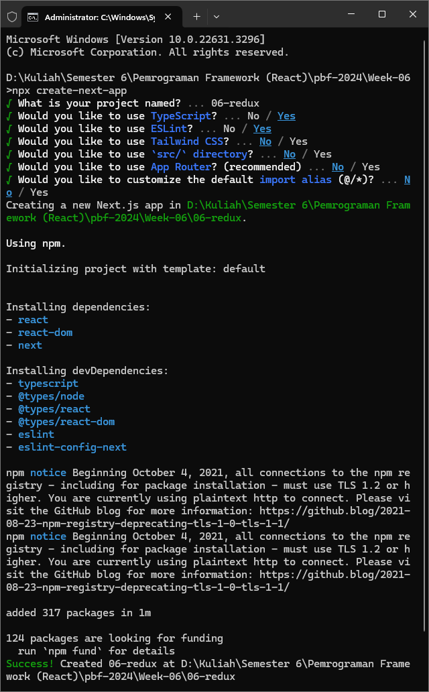
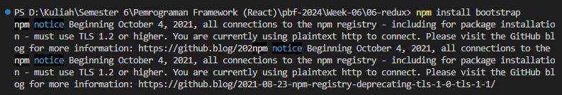
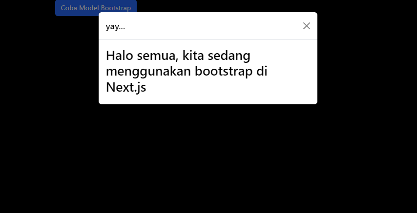

# 06 | React Redux

## Praktikum 1: Instalasi Redux dan bootstrap

> **INFO**
>
> Kita install project *next.js* **baru**, karena kita tidak menggunakan default App Router. Kita buat project baru dengan nama `pertemuan-06` pada repo PBF kita.



Kita buka open folder untuk project `pertemuan-06` di VS Code, maka isi direktori yang ada di dalamnya sedikit berbeda dengan project yang sudah pernah kita buat sebelumnya. Yaitu terdapat folder **`pages`** dan **`styles`**.

Kali ini kita coba pakai CSS Library Bootstrap dengan menjalankan perintah
```
npm install bootstrap
```



Kemudian kita import bootstrap pada aplikasi `next.js` kita. Kita edit file `pages/_app.tsx`

```tsx
import "bootstrap/dist/css/bootstrap.min.css";
import "@/styles/globals.css";
import { useEffect } from "react";

function MyApp({Component, pageProps}:any) {
  useEffect(()=>{
    require("bootstrap/dist/js/bootstrap.bundle.min.js");
  },[]);
 
    return <Component {...pageProps} />;
}

export default MyApp;
```

Sekarang kita perlu mencoba implementasi bootstrap pada project next.js kita.

Contoh kita edit file `pages/index.tsx` menjadi seperti ini
```tsx
export default function Home() {
  return (      
    <div className="container">
      <div className="row">
        <div className="col-12">
          <button type="button"
                  className="btn btn-primary"
                  data-bs-toggle="modal"
                  data-bs-target="#exampleModal">
                  Coba Model Bootstrap
          </button>
        </div>
      </div>
      <div  className="modal fade"
            id="exampleModal"
            tabIndex="-1"
            aria-labelledby="exampleModalLabel"
            aria-hidden="true">
        <div className="modal-dialog">
          <div className="modal-content">
            <div className="modal-header">
              <h5 className="modal-title text-black" id="exampleModalLabel"> yay... </h5>
              <button
                type="button"
                className="btn-close"
                data-bs-dismiss="modal"
                aria-label="Close"></button>
            </div>
            <div className="modal-body text-black">
              <h2>Halo semua, kita sedang menggunakan bootstrap di Next.js</h2>
            </div>
          </div>
        </div>
      </div>
    </div>
  );
}
```

> Coba kita jalankan project next.js kita, dan laporkan apa yang terjadi?

