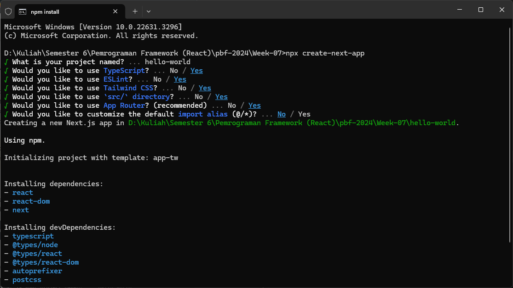
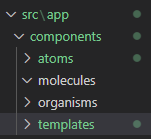
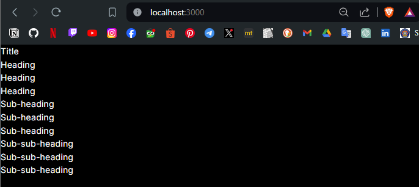
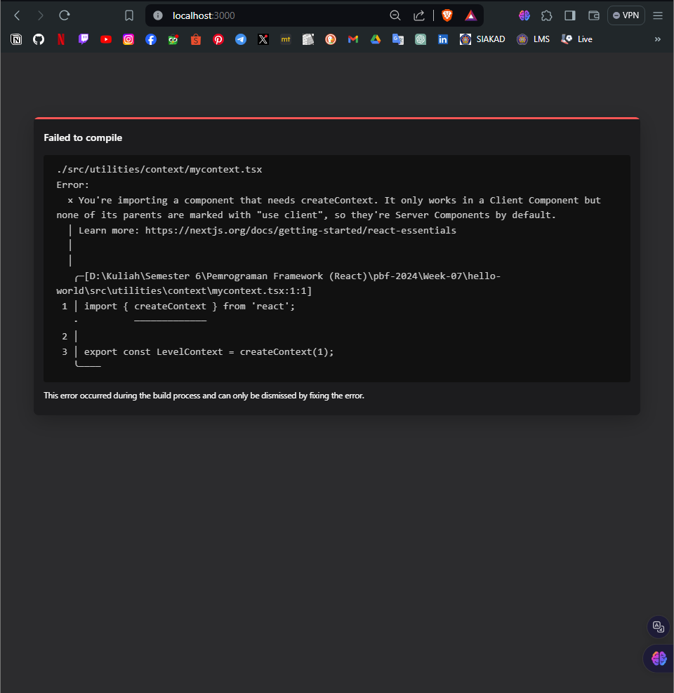
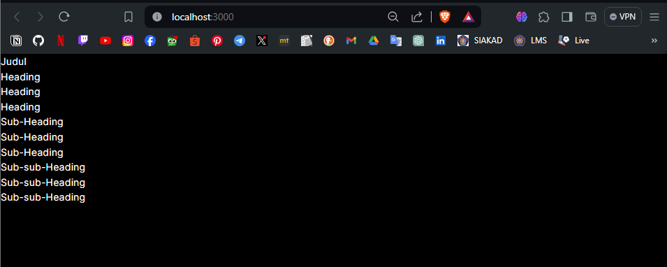
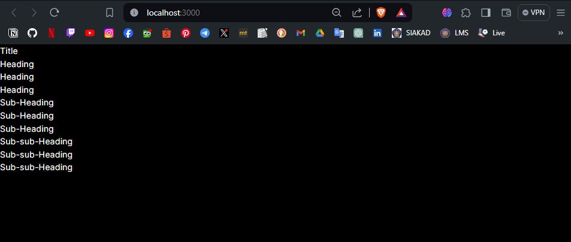
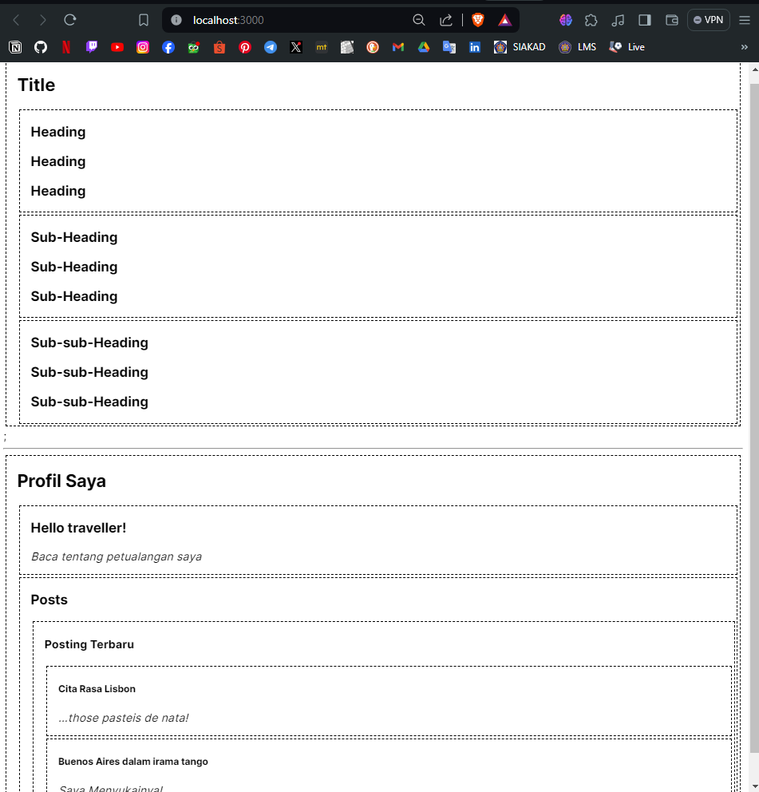
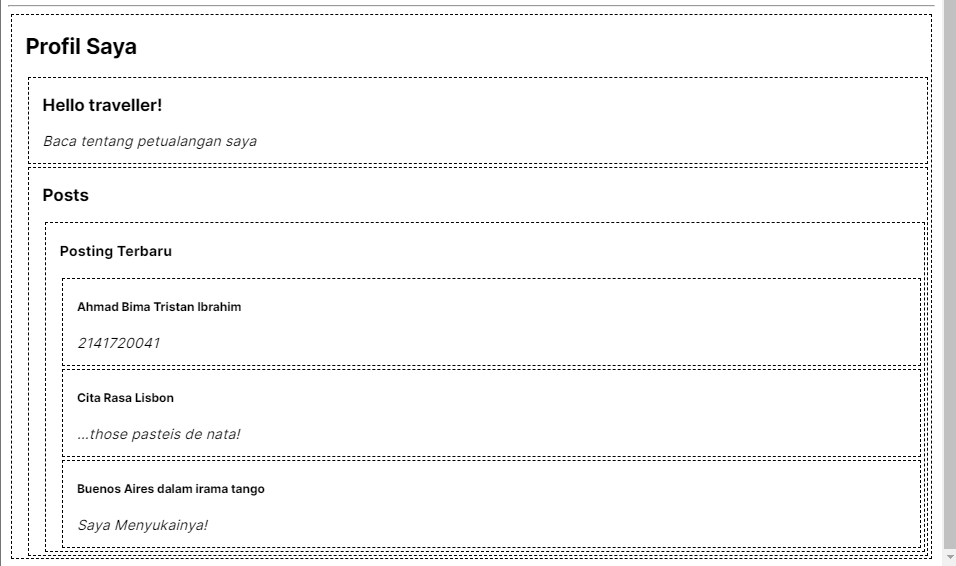

#  07 | Context

## Praktikum 1: Membuat Variasi Ukuran Teks Heading dengan Context

### Langkah 1: Buat project baru dan repo baru di GitHub

Silakan buat project baru seperti berikut dan repo baru dengan nama **#07-belajar-context-nextjs**



### Langkah 2: Buat struktur folder dengan prinsip atomic design

Buatlah folder baru di `src/components` seperti berikut ini



### Langkah 3: Buat komponen atom baru

Buat file baru di `src/components/atoms/heading.tsx` berisi kode sebagai berikut.

```tsx
export default function Heading({ level, children }: { level: number; children: any }) {
    switch (level) {
        case 1:
            return <h1>{children}</h1>;
        case 2:
            return <h2>{children}</h2>;
        case 3:
            return <h3>{children}</h3>;
        case 4:
            return <h4>{children}</h4>;
        case 5:
            return <h5>{children}</h5>;
        case 6:
            return <h6>{children}</h6>;
        default:
            throw Error('Unknown level: ' + level);
    }
}
```

Kemudian buat file baru di `src\components\atoms\section.tsx` berisi kode berikut.
```tsx
export default function Section({ children }: { children: any }) {
    return (
        <section className="section">
            {children}
        </section>
    );
}
```

Lalu bagian `MainPage` buat file baru di `src\components\templates\main_page.tsx` berisi kode sebagai berikut.
```tsx
import Heading from "../atoms/heading";
import Section from "../atoms/section";

export default function MainPage() {
    return (
        <Section>
            <Heading level={1}>Title</Heading>
            <Section>
                <Heading level={2}>Heading</Heading>
                <Heading level={2}>Heading</Heading>
                <Heading level={2}>Heading</Heading>
                <Section>
                    <Heading level={3}>Sub-heading</Heading>
                    <Heading level={3}>Sub-heading</Heading>
                    <Heading level={3}>Sub-heading</Heading>
                    <Section>
                        <Heading level={4}>Sub-sub-heading</Heading>
                        <Heading level={4}>Sub-sub-heading</Heading>
                        <Heading level={4}>Sub-sub-heading</Heading>
                    </Section>
                </Section>
            </Section>
        </Section>
    );
}
```

### Langkah 4: Ubah isi kode page.tsx dan run

Ubahlah kode di `src\app\page.tsx` seperti berikut. Lalu run dan lihat hasilnya di browser Anda.
```tsx
import MainPage from "@/app/components/templates/main_page";

export default function Home() {
  return <MainPage />;
}
```

> **Soal 1**
> Capture hasilnya dan buatlah laporan di **README.md**. Jelaskan apa yang telah Anda pelajari dan bagaimana tampilannya saat ini?
>
> Jangan lupa push dengan pesan commit: `"W07: Jawaban soal 1"`.

Jawab:



Dari hasil run di atas kita menampilan teks yang berada pada main_page.tsx

### Langkah 5.1: Buat Context

Pertama, Anda perlu membuat `context`. Anda harus mengekspornya dari sebuah file sehingga komponen Anda dapat menggunakannya. Buatlah file baru di `src\utilities\context\mycontext.tsx` yang berisi kode sebagai berikut:
```tsx
import { createContext } from 'react';

export const LevelContext = createContext(1);
```

### 5.2: Gunakan context

Ubahlah isi kode komponen `Heading` dengan Impor `useContext` Hook dari React dan context Anda:
```tsx
import { LevelContext } from "@/utilities/context/mycontext";
import { useContext } from "react";
```
Saat ini, komponen` Heading` membaca `level` dari props. Sebagai gantinya, hapus prop `level` dan baca nilai dari context yang baru saja Anda impor, `LevelContext`:
```tsx
export default function Heading({ children }: { children: any }) {
    const level = useContext(LevelContext);
    switch (level) {
```
`useContext` adalah sebuah Hook. Sama seperti `useState` dan `useReducer`, Anda hanya dapat memanggil sebuah Hook secara langsung di dalam komponen React (bukan di dalam pengulangan atau pengkondisian). `useContext` **memberitahu React bahwa komponen** `Heading` **mau membaca** `LevelContext`.

Sekarang komponen `Heading` tidak membutuhkan sebuah prop `level`, Anda tidak perlu mengoper level prop ke `Heading` di JSX Anda. Sebagai gantinya Perbarui JSX sehingga `Section` yang dapat menerimanya:
```tsx
export default function MainPage() {
    return (
        <Section level={1}>
            <Heading>Judul</Heading>
            <Section level={2}>
                <Heading>Heading</Heading>
                <Heading>Heading</Heading>
                <Heading>Heading</Heading>
            </Section>
            <Section level={3}>
                <Heading>Sub-Heading</Heading>
                <Heading>Sub-Heading</Heading>
                <Heading>Sub-Heading</Heading>
            </Section>
            <Section level={4}>
                <Heading>Sub-sub-Heading</Heading>
                <Heading>Sub-sub-Heading</Heading>
                <Heading>Sub-sub-Heading</Heading>
            </Section>
        </Section>
    );
}
```
Perhatikan contoh ini masih belum berfungsi dengan baik! Semua judul memiliki ukuran yang sama karena **meskipun Anda menggunakan context, Anda belum menyediakannya**. React tidak tahu darimana untuk mendapatkannya!

Jika Anda tidak menyediakan context, React akan menggunakan nilai default yang sudah Anda tentukan di langkah sebelumnya. Di contoh ini, Anda menentukan `1` sebagai argumen `createContext`, jadi `useContext(LevelContext)` mengembalikan `1`, mengatur semua headings ke `< h1 >`. Ayo kita perbaiki masalah ini dengan membuat setiap `Section` menyediakan context-nya sendiri.

### Langkah 5.3: Sediakan context

Komponen Section saat ini merenders anaknya, bungkus mereka semua dengan sebuah context provider untuk menyediakan LevelContext kepada mereka seperti kode berikut:
```tsx
import { LevelContext } from "@/utilities/context/mycontext";

export default function Section({  level, children }: { level: number, children: any }) {
    return (
        <section className="section">
            <LevelContext.Provider value={level}>
                {children}
            </LevelContext.Provider>
        </section>
    );
}
```
ni memberitahu React: "jika ada komponen di dalam `< Section >` ini yang meminta `LevelContext`, berikan level ini." Komponen akan menggunakan nilai dari `< LevelContext.Provider >` terdekat di pohon UI (tree) di atasnya.

Hasilnya sama dengan kode aslinya, tapi Anda tidak perlu mengoper prop `level` ke setiap komponen `Heading`! Sebagai gantinya, ia "mencari tahu" level heading-nya dengan meminta Section terdekat di atasnya:
1. Anda mengoper prop `level` ke `< Section >`.
2. `Section` membungkus anaknya dengan `< LevelContext.Provider value={level} >`.
3. `Heading` meminta nilai terdekat dari `LevelContext` di atasnya dengan `useContext(LevelContext)`.

> Soal 2
> Capture hasilnya dan buatlah laporan di README.md. Jelaskan apa yang telah Anda pelajari dan bagaimana tampilannya saat ini?
>
> Jika terjadi error, silakan perbaiki, Mengapa hal itu bisa terjadi? Jelaskan!
>
> Jangan lupa push dengan pesan commit: "W07: Jawaban soal 2".

Jawab:



Terdapat error saat menjalan npm run dev karena kita belum menambahkan `"use client";` pada file  `page.tsx`

Setelah menambahkan `use client`



### Langkah 6: Menggunakan dan menyediakan context dari komponen yang sama

Saat ini, Anda masih harus menentukan setiap `level section` secara manual, karena context memungkinan Anda membaca informasi dari komponen di atasnya, setiap `Section` dapat membaca `level` dari `Section` di atasnya, dan mengoper `level + 1` ke bawah secara otomatis. Berikut adalah bagaimana Anda dapat melakukannya dengan mengubah sedikit kode pada komponen `Section`:
```tsx
import { LevelContext } from "@/utilities/context/mycontext";

export default function Section({ children }: { children: any }) {
    const level = useContext(LevelContext);
    return (
        <section className="section">
            <LevelContext.Provider value={level}>
                {children}
            </LevelContext.Provider>
        </section>
    );
}
```
Dengan perubahan ini, Anda tidak perlu mengoper prop level baik ke `< Section >` atau ke `< Heading >`:
```tsx
export default function MainPage() {
    return (
        <Section>
            <Heading>Title</Heading>
            <Section>
                <Heading>Heading</Heading>
                <Heading>Heading</Heading>
                <Heading>Heading</Heading>
            </Section>
            <Section>
                <Heading>Sub-Heading</Heading>
                <Heading>Sub-Heading</Heading>
                <Heading>Sub-Heading</Heading>
            </Section>
            <Section>
                <Heading>Sub-sub-Heading</Heading>
                <Heading>Sub-sub-Heading</Heading>
                <Heading>Sub-sub-Heading</Heading>
            </Section>
        </Section>
    );
}
```
```tsx
import { LevelContext } from "@/utilities/context/mycontext";
import { useContext } from "react";

export default function Heading({ children }: { children: any }) {
    const level = useContext(LevelContext);
    switch (level) {
        case 0:
            throw Error('Heading must be inside a Section!');
        case 1:
            return <h1>{children}</h1>;
        case 2:
            return <h2>{children}</h2>;
        case 3:
            return <h3>{children}</h3>;
        case 4:
            return <h4>{children}</h4>;
        case 5:
            return <h5>{children}</h5>;
        case 6:
            return <h6>{children}</h6>;
        default:
            throw Error('Unknown level: ' + level);
    }
}
```
Sekarang keduanya `Heading` dan `Section` membaca `LevelContext` untuk mencari tahu seberapa "dalam" mereka. Dan `Section` membungkus anaknya ke dalam `LevelContext` untuk menentukan bahwa apa pun yang ada di dalamnya berada pada level yang "lebih dalam".

> Soal 3
> Capture hasilnya dan buatlah laporan di README.md. Jelaskan apa yang telah Anda pelajari dan bagaimana tampilannya saat ini?
> 
> Jangan lupa push dengan pesan commit: "W07: Jawaban soal 3".

Jawab: 



Tidak ada perubahan dari segi tampilan

## Praktikum 2: Membuat Context melewati komponen perantara

### Langkah 1: Buat komponen atom baru

Buatlah file baru di `src\components\atoms\section2.tsx` berisi kode sebagai berikut.
```tsx
import { LevelContext } from "@/utilities/context/mycontext";
import { useContext } from "react";

export default function Section2({children, isFancy}: {children: any, isFancy: boolean}){
    const level = useContext(LevelContext);
    return(
        <section className={'section' + (isFancy?'Fancy':'')}>
            <LevelContext.Provider value={level+1}>
                {children}
            </LevelContext.Provider>
        </section>
    )
}
```
Lalu buatlah file baru di `src\components\atoms\post.tsx` dengan kode berikut.
```tsx
import Heading from "./heading";
import Section2 from "./section2";

export default function Post({title, body}: {title: string, body: string}){
    return(
        <Section2 isFancy={true}>
            <Heading>
                {title}
            </Heading>
            <p><i>{body}</i></p>
        </Section2>
    )
}
```
Selanjutnya kita buat molecules di `src\components\molecules\recentpost`.tsx dengan kode berikut.
```tsx
import Heading from "../atoms/heading";
import Post from "../atoms/post";
import Section2 from "../atoms/section2";

export default function RecentPosts() {
    return(
        <Section2 isFancy= {true}>
            <Heading>Posting Terbaru</Heading>
            <Post 
                title="Cita Rasa Lisbon" 
                body="...those pasteis de nata!"
            />
            <Post 
                title="Buenos Aires dalam irama tango" 
                body="Saya Menyukainya!"
            />
        </Section2>
    )
}
```
Kemudian buat organisms di `src\components\organisms\allpost.tsx` dengan kode berikut.
```tsx
import Heading from "../atoms/heading";
import Section2 from "../atoms/section2";
import RecentPosts from "../molecules/recentpost";

export default function AllPosts(){
    return(
        <Section2 isFancy={true}>
            <Heading>Posts</Heading>
            <RecentPosts/>
        </Section2>
    )
}
```
Terakhir kita buat templates di `src\components\templates\profile_page.tsx` dengan kode berikut.
```tsx
import Heading from "../atoms/heading";
import Post from "../atoms/post";
import Section2 from "../atoms/section2";
import AllPosts from "../organisms/allpost";

export default function ProfilePage(){
    return(
        <Section2 isFancy={true}>
            <Heading>Profil Saya</Heading>
            <Post 
                title="Hello traveller!" 
                body="Baca tentang petualangan saya"
            />
            <AllPosts/>
        </Section2>
    )
}
```
**Langkah 2: Tambahkan ProfilePage ke page.tsx lalu run**
Tambahkan komponen `ProfilePage` seperti kode berikut.
```tsx
"use client";
import MainPage from "@/app/components/templates/main_page";
import ProfilePage from "@/app/components/templates/profile_page";

export default function Home() {
  return (
    <>
      <MainPage />;
      <hr />
      <ProfilePage />
    </>
  );
}
```
Hapus bagian `theme` pada file `tailwind.config.ts` seperti kode berikut.
```tsx
import type { Config } from "tailwindcss";

const config: Config = {
  content: [
    "./src/pages/**/*.{js,ts,jsx,tsx,mdx}",
    "./src/components/**/*.{js,ts,jsx,tsx,mdx}",
    "./src/app/**/*.{js,ts,jsx,tsx,mdx}",
  ],
  theme: {
  },
  plugins: [],
};
export default config;

```
Hapus semua style CSS di file `src\app\globals.css` lalu ganti dengan kode berikut.
```tsx
section{
  border-color: black;
  border-width: 2px;
  padding-left: 15px;
  margin: 3px;
  border-style: dashed;
}
```

Hasil Run


>**Soal 4**
>
>Capture hasilnya dan buatlah laporan di **README.md**. Tambahkan teks Nama dan NIM pada bagian komponen `Post` agar menunjukkan itu hasil kerja Anda!
>
>**Jangan lupa push dengan pesan commit**: `"W07: Jawaban soal 4"`.

Jawab:

Hasil Run

