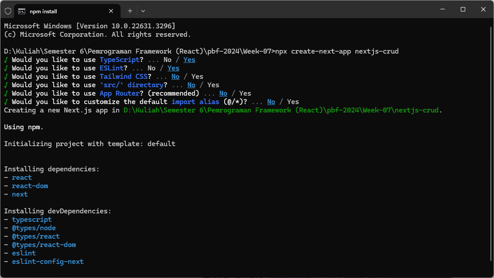
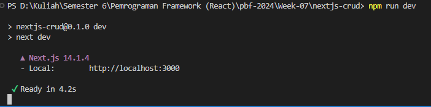

# 07 | Next.js CRUD

## Praktikum 1: Membuat Project Baru di Next.js

### Langkah 1 - Membuat Project Baru

```
npx create-next-app nextjs-crud
```



### Langkah 2 - Menjalankan Project Next.js

```
npm run dev
```



