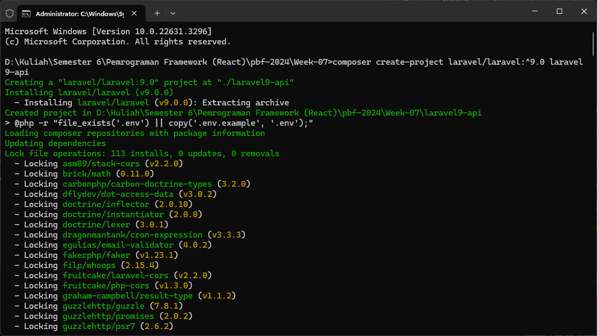
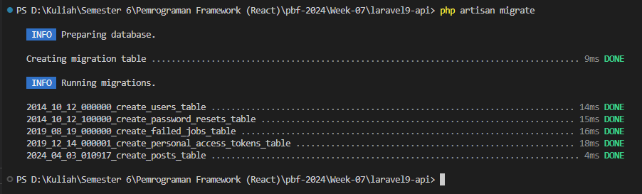

# 07 | Next.js CRUD

# Praktikum Laravel

## Praktikum 1 - Install Laravel 9

### Langkah 1 - Install Laravel

```
composer create-project laravel/laravel:^9.0 laravel9-api
```



### Langkah 2 - Menjalankan Project

```
php artisan serve
```


### Langkah 3 - Konfigurasi Koneksi Database

Buka file `.env` dan ubah kode menjadi seperti ini
```
DB_DATABASE=db_laravel9_api
DB_USERNAME=root
DB_PASSWORD=
```

### Langkah 4 - Membuat Database

Buat database baru di phpmyadmin


### Langkah 5 - Membuat Model dan Migration

Jalankan perintah dibawah di dalam terminal/CMD
```
php artisan make:model Post -m
```


Jika perintah diatas berhasil di maka akan terdapat 2 file baru yaitu
- app/Models/Post.php
- database/migrations/2024_04_03_010917_create_posts_table.php

Kita akan menambahkan beberapa field untuk table `posts`. Buka file `2024_04_03_010917_create_posts_table.php` kemudian ubah kode pada `function up` seperti ini
```php
public function up()
{
  Schema::create('posts', function (Blueprint $table) {
    $table->id();
    $table->string('image');
    $table->string('title');
    $table->text('content');
    $table->timestamps();
  });
}
```

### Langkah 6 - Menjalankan Migration

Jalankan perintah berikut di dalam terminal/CMD
```
php artisan migrate
```




### Langkah 7 - Menambahkan Mass Assigment

Buka file `app/Models/Post.php`, kemudian ubah kode nya menjadi seperti ini
```php
<?php

namespace App\Models;

use Illuminate\Database\Eloquent\Factories\HasFactory;
use Illuminate\Database\Eloquent\Model;

class Post extends Model
{
    use HasFactory;
    
    /**
     * fillable
     *
     * @var array
     */
    protected $fillable = [
        'image',
        'title',
        'content',
    ];
}
```

### Langkah 8 - Menjalankan Storage Link

Jalankan perintah berikut di dalam terminal/CMD
```
php artisan storage:link
```


Maka akan muncul file/folder baru dengan nama `storage` yang mereferensikan ke dalam folder `storage/app/public`

## Praktikum 2 - Membuat API Resources

### Langkah 1 - Membuat API Resources

Jalankan perintah berikut di terminal/CMD
```
php artisan make:resource PostResource
```


Jika perintah berhasil, makan akan terdapat 1 file resource baru dengan nama `PostResource.php` yang berada di dalam folder `app/Http/Resources`

### Langkah 2 - Melakukan Custom API Resources
 
Buka file `app/Http/Resources/PostResource.php`, kemudian ubah kode nya menjadi seperti berikut
```php
<?php

namespace App\Http\Resources;

use Illuminate\Http\Resources\Json\JsonResource;

class PostResource extends JsonResource
{
    //define properti
    public $status;
    public $message;
    
    /**
     * __construct
     *
     * @param  mixed $status
     * @param  mixed $message
     * @param  mixed $resource
     * @return void
     */
    public function __construct($status, $message, $resource)
    {
        parent::__construct($resource);
        $this->status  = $status;
        $this->message = $message;
    }

    /**
     * Transform the resource into an array.
     *
     * @param  \Illuminate\Http\Request  $request
     * @return array
     */
    public function toArray($request)
    {
        return [
            'success'   => $this->status,
            'message'   => $this->message,
            'data'      => $this->resource
        ];
    }
}
```


# Praktikum Nextjs

## Praktikum 1: Membuat Project Baru di Next.js

### Langkah 1 - Membuat Project Baru

```
npx create-next-app nextjs-crud
```


### Langkah 2 - Menjalankan Project Next.js

```
npm run dev
```


## Praktikum 2: Install Bootsrap dan Membuat Layout di Next.js

### Langkah 1 - Install Bootstrap

```
npm install bootstrap
```


### Langkah 2: Konfigurasi Boostrap di Next.js

Tambahkan kode berikut di dalam file -app.tsx
```ts
import "bootstrap/dist/css/bootstrap.min.css";
```

Mengubah background dari aplikasi pada file styles/global.css
```tsx
body{
  background: lightgray!important;
}
```


### Langkah 3: Membuat Komponen Navbar

Buat folder baru dengan nama `components` dan buat fila baru di dalam folder tersebut dengan nama `navbar.tsx`
```tsx
//import Link
import Link from 'next/link';

function Navbar() {

    return (
        <header>
            <nav className="navbar navbar-expand-md navbar-dark fixed-top bg-dark fixed-top border-0 shadow-sm">
                <div className="container">
                    <Link href="/">
                        <a className="navbar-brand">LARAVEL & NEXT.JS</a>
                    </Link>
                    <button className="navbar-toggler" type="button" data-bs-toggle="collapse" data-bs-target="#navbarCollapse" aria-controls="navbarCollapse" aria-expanded="false" aria-label="Toggle navigation">
                        <span className="navbar-toggler-icon"></span>
                    </button>
                    <div className="collapse navbar-collapse" id="navbarCollapse">
                        <ul className="navbar-nav me-auto mb-2 mb-md-0">
                            <li className="nav-item">
                                <Link href="/posts"><a className="nav-link">POSTS</a></Link>
                            </li>
                            <li className="nav-item">
                                <a className="nav-link" href="" target="_blank">Bima Tristan</a>
                            </li>
                        </ul>
                        <form className="d-flex">
                            <input className="form-control me-2" type="search" placeholder="Search" aria-label="Search"/>
                            <button className="btn btn-success" type="submit">Search</button>
                        </form>
                    </div>
                </div>
            </nav>
        </header>
    )

}

export default Navbar
```

### Langkah 4: Membuat Layout

Buat file baru di dalam folder `components` dengan nama `layout.tsx`
kemudian masukan kode berikut
```tsx
//import component Navbar
import Navbar from './navbar'

export default function Layout({ children }) {
  return (
    <>
      <Navbar />
      <main>{children}</main>
    </>
  )
}
```


## Praktikum 3: Menampilkan Data di Next.js (Server Side)

### Langkah 1: Install Axios

```
npm install axios
```


### Langkah 2: Konfigurasi Env untuk Endpoint

```
NEXT_PUBLIC_API_BACKEND = 'http://localhost:8000'
```

### Langkah 3: Menampilkan Data di NextJS

Buat folder baru dengan nama `posts` di dalam folder `pages`, buat file baru dengan dama `index.tsx`
```tsx
//layout
import Layout from "../../components/layout";

//import Link
import Link from 'next/link';

//import axios
import axios from "axios";

//fetch with "getServerSideProps"
export async function getServerSideProps() {

    //http request
    const req  = await axios.get(`${process.env.NEXT_PUBLIC_API_BACKEND}/api/posts`)
    const res  = await req.data.data.data

    return {
      props: {
          posts: res // <-- assign response
      },
    }
  }

function PostIndex(props) {

    //destruct
    const { posts } = props;

    return(
        <Layout>
            <div className="container" style={{ marginTop: '80px' }}>
                <div className="row">
                    <div className="col-md-12">
                        <div className="card border-0 shadow-sm rounded-3">
                            <div className="card-body">
                                <Link href="/posts/create">
                                    <button className="btn btn-primary border-0 shadow-sm mb-3">TAMBAH</button>
                                </Link>
                                <table className="table table-bordered mb-0">
                                    <thead>
                                        <tr>
                                            <th scope="col">IMAGE</th>
                                            <th scope="col">JUDUL</th>
                                            <th scope="col">CONTENT</th>
                                            <th scope="col">AKSI</th>
                                        </tr>
                                    </thead>
                                    <tbody>
                                    { posts.map((post) => (
                                        <tr key={ post.id }>
                                            <td className="text-center">
                                                
                                            </td>
                                            <td>{ post.title }</td>
                                            <td>{ post.content }</td>
                                            <td className="text-center">
                                                <button className="btn btn-sm btn-primary border-0 shadow-sm mb-3 me-3">EDIT</button>
                                                <button className="btn btn-sm btn-danger border-0 shadow-sm mb-3">DELETE</button>
                                            </td>
                                        </tr>
                                    )) }
                                    </tbody>
                                </table>  
                            </div>
                        </div>
                    </div>
                </div>
            </div>
        </Layout>
    )
}

export default PostIndex
```